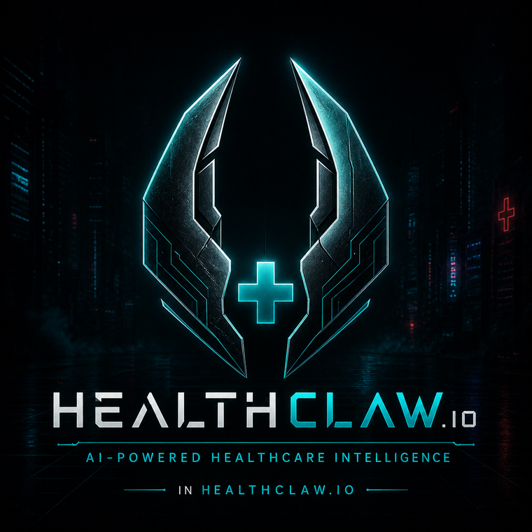

<div align="center">



# HealthClaw Guardrails

### La capa de seguridad de código abierto entre agentes de IA y datos clínicos.

*FHIR estandarizó cómo se estructuran los datos de salud. MCP estandarizó cómo la IA se conecta a las herramientas.*
***Nadie estandarizó las medidas de seguridad en el medio. Este proyecto lo hace.***

<br/>

<!-- Project -->
[](https://github.com/aks129/HealthClawGuardrails/releases)
[](LICENSE)
[](https://github.com/aks129/HealthClawGuardrails/actions/workflows/ci.yml)
[](https://github.com/aks129/HealthClawGuardrails)

<!-- Community metrics -->
[](https://github.com/aks129/HealthClawGuardrails/stargazers)
[](https://github.com/aks129/HealthClawGuardrails/network/members)
[](https://github.com/aks129/HealthClawGuardrails/issues)
[](https://github.com/aks129/HealthClawGuardrails/graphs/contributors)
[](https://github.com/aks129/HealthClawGuardrails/commits/main)

<!-- Stack & scope -->
[](#testing)
[](#mcp-tools-29)
[](#fhir-version-support)
[](#what-this-grade-means-and-what-it-doesnt)
[](https://glama.ai/mcp/servers/aks129/HealthClawGuardrails)
[](pyproject.toml)
[](#docker)

<br/>

**[Inicio Rápido](#quick-start)** · **[Herramientas MCP](#mcp-tools-29)** · **[Recetas](docs/recipes/)** · **[Hoja de Ruta](ROADMAP.md)** · **[Plugin para Claude](#install-as-a-claude-plugin)** · **[Arquitectura](#what-it-does)** · **[healthclaw.io](https://healthclaw.io)** · **[Contribuir](CONTRIBUTING.md)** · **[Guía de Desarrollo](docs/development.md)**

</div>

---

> **Qué es:** una implementación de referencia abierta de la capa de guardrails FHIR × MCP — enmascaramiento de PHI, auditoría inmutable, autenticación escalada y aislamiento por tenant — que se sitúa entre *cualquier* agente de IA y *cualquier* servidor FHIR. Construido abiertamente como un proyecto comunitario, con licencia MIT. No es un producto, ni una propuesta: si el patrón es útil, úsalo; si está mal, dinos o corrígelo.

**Este es un esfuerzo comunitario.** Es más útil cuando implementadores, clínicos y expertos en estándares encuentran sus fallos. Issues, PRs y críticas como "te equivocaste en la extracción de SDC" son bienvenidas — comienza por **[CONTRIBUTING.md](CONTRIBUTING.md)** y el **[Código de Conducta](CODE_OF_CONDUCT.md)**.

**Vista general:** v1.9.0 · 1,490+ Python + 170 Node pruebas · 29 herramientas MCP · **[CareAgents](https://careagents.cloud)** aplicación consumidora alojada (inicio de sesión con passkey, asesores, web/Telegram/iMessage) · riel de acciones reales (puerta comprobablemente fuera de banda) · riel de formularios de extremo a extremo (`$populate` → revisión humana → PDF con procedencia) · FHIR R4 US Core v9 + R6 v6.0.0-ballot3 · Formularios HL7 SDC · Medida de calidad NQF 0018 · intérprete de laboratorios (`$interpret`) · recordatorios de brechas de atención (`$care-gaps`) + vista MCP-App integrada · conector ChatGPT `search`/`fetch` · Fasten TEFCA · HealthEx · HBO · Flexpa · Epic · MEDENT · Open Wearables · SMART Health Links · plugin Claude Code · adaptadores OpenAI/Gemini

## Pruébalo en 60 segundos — sin clonar, sin claves

La demostración alojada ejecuta datos sintéticos detrás de la pila completa de guardrails:

```bash
# Observa cómo la implementación califica sus propios guardrails (enmascaramiento PHI, auditoría, autenticación escalada, ...):
curl "https://app.healthclaw.io/r6/fhir/\$conformance?format=text"
```

Apunta cualquier cliente MCP al **servidor de demostración público** — URL `https://mcp-demo-production-ee2c.up.railway.app/mcp`,
sin clave requerida — y pregunta: *"Busca en mis registros de salud los resultados de laboratorio y explícalos en lenguaje sencillo."* El servidor de demostración no está autenticado pero está fijo a un tenant de demostración sintético, por lo que solo puede servir datos falsos. El **endpoint de producción** (`https://mcp-server-production-5112.up.railway.app/mcp`)
requiere un `Authorization: Bearer <token>` con alcance de implementación — los registros reales siempre permanecen detrás de autenticación.
Instalación con un comando:
`gemini extensions install https://github.com/aks129/HealthClawGuardrails` ·
`claude plugin marketplace add aks129/HealthClawGuardrails` ·
habilidades en [ClawHub](https://clawhub.ai/aks129/skills/fhir-r6-guardrails)

**¿No eres desarrollador?** Guías paso a paso para Claude (web/escritorio/teléfono), Perplexity,
ChatGPT y Telegram — más un guion de demostración de 10 minutos — en [docs/quickstarts/](docs/quickstarts/README.md).

**Listado en:** [Registro Oficial MCP](https://registry.modelcontextprotocol.io) (`io.github.aks129/healthclaw-guardrails`) ·
[Glama](https://glama.ai/mcp/servers/aks129/HealthClawGuardrails) ([conector alojado](https://glama.ai/mcp/connectors/io.github.aks129/healthclaw-guardrails)) ·
[ClawHub](https://clawhub.ai/aks129/skills/fhir-r6-guardrails) (14 habilidades) ·
Extensiones CLI de Gemini · descubrimiento de agent-skills en [`/.well-known/agent-skills/`](https://healthclaw.io/.well-known/agent-skills/index.json)

## Novedades de la versión

Las notas completas están en **[Releases](https://github.com/aks129/HealthClawGuardrails/releases)**.

| Versión | Novedades |
| --- | --- |
| **v1.9.0** | **[CareAgents](https://careagents.cloud) — la experiencia consumidora alojada**: regístrate con un passkey, conecta registros a través de un marketplace de conectores enchufables (Fasten, Apple Health vía Open Wearables, datos de muestra), y despliega un agente de salud con guardrails accesible en web, Telegram e iMessage · **registro de asesores** — especialidades importadas de SmartHealthConnect (hábitos-saludables, finalización-atención, recargas-medicamentos, dieta-ejercicio) como bloques de prompt sobre el conjunto de herramientas protegido, los diferidos están honestamente etiquetados · **consentimiento informado versionado** aplicado del lado del servidor (HTTP 428) antes de cualquier conexión de registro real · **riel de formularios de extremo a extremo** — `$populate` → revisión humana por ítem (NKA nunca inferido) → PDF con procedencia estampada → enlace expirable firmado · **la fidelidad de errores es la propiedad siete de conformidad (Grado A = 7/7)**, reforzada en ambos transportes MCP con un guard de deriva Python↔TypeScript · **MCP Apps** — los resultados de brechas de atención incorporan una UI servida por el motor (`text/html; profile=mcp-app`) cuyo único objetivo de recuperación es la operación protegida · pase de seguridad: configuración de producción cerrada ante fallos, lecturas de tenant autenticadas, autenticación de transporte MCP, Alembic · SmartHealthConnect archivado (habilidades congeladas en v1.2.0; los asesores son los sucesores activos) |
| **v1.8.0** | **Base de acciones reales** — un agente puede *proponer* una acción del mundo real (llamada, SMS, formulario) pero `commit` solo *envía* la solicitud (HTTP 202); la ejecución ocurre a través de una aprobación separada que requiere una credencial de autenticación escalada de un solo uso y una reclamación atómica protegida por expiración, por lo que la propia cadena de herramientas del agente nunca puede aprobar su propia acción (el encabezado falsificable `X-Human-Confirmed` ha desaparecido) · **registro de plugins `ActionExecutor`** — añade una capacidad del mundo real detrás del riel completo de guardrails en ~50 líneas, sin cambios en el núcleo ([extiéndelo](ROADMAP.md#extending-the-action-rail)) · pantalla obligatoria de emergencia con banderas rojas; rieles de fallo ruidoso (sin simulación silenciosa) · **ejecución durable** — libro mayor de intentos, conciliación de proveedor, recolector de tics externos, registro append-only de eventos de acción · **suelo de fiabilidad** — preflight de configuración (`GET /r6/ops/preflight`), carril CI de Postgres, tiempos de espera de recuperación MCP, detección de tormenta 409 del polerador, identidad de recurso consciente del origen `(tenant, type, id)`, endurecimiento Fasten + recolector de trabajos zombi · [HOJA DE RUTA](ROADMAP.md) pública + ruta de entrada para contribuyentes · correcciones: fidelidad de errores FHIR upstream, medidas de calidad por defecto al año actual |
| **v1.7.0** | Motor de brechas de atención preventiva (`Patient/$care-gaps`, USPSTF/ACIP/ADA + cruce eCQM) · flujo de conexión de paciente: el onboarding Fasten verificado por identidad acuña un token de agente de solo lectura de 30 días protegido por webhook · solicitudes de transferencia de receta (`rx_transfer_request`, se rechaza Schedule II) — 29 herramientas MCP · [inicios rápidos por agente](docs/quickstarts/) (Claude/Perplexity/ChatGPT/Telegram) · convertidor HBO export→FHIR + depurador PHI XML integrado · endurecimiento: verificación de webhook cerrada ante fallos, tokens con alcance, guard de escritura serverless, pruebas de contrato en vivo · correcciones clínicas: detección de diabetes SNOMED, umbrales de pánico inclusivos, honestidad en rangos unilaterales |
| **v1.6.0** | Intérprete de rangos de referencia de laboratorio (`Observation/$interpret`) · Medida de calidad NQF 0018 (`Measure/$evaluate-measure`) · [adaptadores para cualquier framework de agente](docs/recipes/any-agent-framework.md) (OpenAI/Gemini) · [receta Medplum-in-front](docs/recipes/healthclaw-in-front-of-medplum.md) · triaje SMBP en AHA/ACC 2025 · puerta de lint ruff · todas las advertencias de dependencias remediadas |
| v1.5.0 | Endurecimiento de autenticación de lectura (lecturas de tenant autenticadas, no solo con alcance) · Formularios HL7 SDC — `$populate` / `$extract` |
| v1.4.0 | Seis conectores de datos de salud (Fasten TEFCA, HealthEx, Health Bank One, Flexpa, Epic, MEDENT) detrás de una sola pila de guardrails |
| v1.3.0 | Wearables → Observaciones FHIR (8 proveedores, mapeo LOINC/UCUM, Procedencia de dispositivo) |
| v1.2.0 | Verdad Compilada — estado actual + rastro de Procedencia append-only por recurso |

## Qué hace

Este es un **proxy de guardrails neutral al proveedor** que se sitúa entre cualquier agente de IA y cualquier servidor FHIR. Cada solicitud pasa por:

- **Enmascaramiento de PHI** — Nombres truncados a iniciales, identificadores enmascarados, direcciones eliminadas, fechas de nacimiento truncadas al año
- **Rastro de auditoría inmutable** — Cada lectura/escritura registrada con tenant, agente, marca de tiempo
- **Autenticación escalada** — Tokens HMAC-SHA256 requeridos para escrituras
- **Supervisión humana** — Las escrituras clínicas están bloqueadas hasta que un humano confirma (HTTP 428); las acciones del mundo real (llamadas, SMS, formularios) van más allá: `commit` solo *envía*, y la ejecución requiere una aprobación de un solo uso **comprobablemente fuera de banda** que la propia cadena de herramientas del agente no puede satisfacer
- **Aislamiento por tenant** — Cada consulta acotada al tenant, acceso cruzado bloqueado
- **Descargos de responsabilidad médicos** — Inyectados en todas las lecturas de recursos clínicos
- **Verdad Compilada** — Estado actual + rastro de evidencia append-only para cada recurso

```text
Agente IA ──▶ Servidor MCP ──▶ Proxy de Guardrails ──▶ Cualquier Servidor FHIR
                              ↓                    (HAPI, Epic,
                         Enmascaramiento PHI          Medplum, etc.)
                         Rastro de auditoría
                         Autenticación escalada
                         Supervisión humana
```

## Demuéstralo: conformidad de guardrails

Los guardrails son **verificables, no marketing.** Un arnés ejecutable prueba cualquier
implementación con datos sintéticos y emite una tarjeta de puntuación en las siete propiedades —
ejecútalo contra tu propia instancia (o la nuestra):

```bash
python scripts/guardrail_conformance.py \
  --base-url https://app.healthclaw.io --tenant desktop-demo \
  --step-up-token "$(mint a token via POST /r6/fhir/internal/step-up-token)"
```

```text
HealthClaw Guardrail Conformance — https://app.healthclaw.io [tenant=desktop-demo]
  Grade: A   (7/7 properties)
  [PASS] PHI Redaction            [PASS] Human-in-the-Loop
  [PASS] Immutable Audit Trail    [PASS] Tenant Isolation
  [PASS] Step-Up Authorization    [PASS] Medical Disclaimers
  [PASS] Error Fidelity — A (local-fhir-only)
```

O ejecuta la **auto-prueba de una URL** en cualquier implementación en ejecución — no se necesita token, se
auto-acuñara internamente y devuelve 200 en Grado A (503 en otro caso):

```bash
curl "https://app.healthclaw.io/r6/fhir/\$conformance?format=text"
```

El perfil FHIR local es Grado A: las entradas de búsqueda local no soportadas son rechazadas
o reportadas según `Prefer: handling`, y cada ruta de fallo es auditada.
El mismo arnés se ejecuta contra el cliente de prueba Flask como **línea base de CI**
(`tests/test_guardrail_conformance.py`). `--json` emite un informe legible por máquina; `--mcp-url` además califica la señalización de errores de MCP `tools/call` como un perfil separado. Para una implementación MCP autenticada, establece `MCP_AUTH_TOKEN` o
pasa `--mcp-auth-token`. API de biblioteca:
`from r6.conformance import LiveProbeClient, ProbeContext, run_conformance`.

### Qué significa esta calificación (y qué no)

La calificación cubre **solo la capa de guardrails de HealthClaw** — una auto-prueba de las
siete propiedades contra datos sintéticos que acaba de crear. **No** es una evaluación de la regla de seguridad HIPAA, una auditoría de terceros o una prueba de penetración de tu
implementación: la infraestructura, BAAs, cifrado en reposo/en tránsito y controles de acceso
siguen siendo responsabilidad del implementador (ver
[Limitaciones Conocidas](#known-limitations)). Como el arnés es
agnóstico a la implementación, un tercero *puede* ejecutarlo contra cualquier instancia como una
entrada para una evaluación real — no la sustituye. El informe declara
este alcance en sí mismo en cada formato de salida.

## Instalar como plugin de Claude

HealthClaw se entrega como un marketplace de plugins para Claude Code. Hay dos plugins disponibles:

```bash
# Añadir el marketplace
claude plugin marketplace add aks129/HealthClawGuardrails

# Instalar el plugin de guardrails FHIR (este repositorio)
claude plugin install healthclaw-guardrails@healthclaw-marketplace

# Instalar el plugin acompañante de salud personal (congelado — upstream archivado)
claude plugin install smarthealthconnect@healthclaw-marketplace
```

| Plugin | Habilidades | Origen |
| --- | --- | --- |
| `healthclaw-guardrails` | curatr, fasten-connect, fhir-r6-guardrails, fhir-upstream-proxy, healthex-export, phi-redaction | [aks129/HealthClawGuardrails](https://github.com/aks129/HealthClawGuardrails) |
| `smarthealthconnect` | care-completion, diet-exercise, healthy-habits, kids-health, medication-refills, research-monitor | [aks129/SmartHealthConnect](https://github.com/aks129/SmartHealthConnect) *(archivado — habilidades congeladas en v1.2.0; los sucesores activos son los asesores de CareAgents)* |

Cada habilidad es auto-descubrible — Claude la carga cuando tu prompt coincide con las frases desencadenantes de la habilidad (ej. "check my care gaps", "redact this bundle", "run Curatr on my conditions").

**¿No usas Claude/MCP?** Las mismas 28 herramientas con guardrails funcionan en OpenAI, Gemini, LangChain o HTTP plano a través del puente neutral a frameworks en [`adapters/`](adapters/) — ver [Receta: ejecutar herramientas HealthClaw en cualquier framework de agente](docs/recipes/any-agent-framework.md). Los guardrails permanecen del lado del servidor, por lo que ningún framework puede omitirlos.

## Inicio Rápido

```bash
# Instalar dependencias
uv sync

# Aplicar migraciones de base de datos deterministas
STEP_UP_SECRET=your-secret uv run flask --app main init-db
STEP_UP_SECRET=your-secret uv run flask --app main seed-demo --tenant-id desktop-demo

# Ejecutar (modo local con SQLite)
STEP_UP_SECRET=your-secret python main.py

# Ejecutar con servidor FHIR upstream
FHIR_UPSTREAM_URL=https://hapi.fhir.org/baseR4 STEP_UP_SECRET=your-secret python main.py

# Abrir navegador
open http://localhost:5000            # Página de aterrizaje con demostración en vivo
open http://localhost:5000/r6-dashboard  # Panel interactivo
```

### Docker

```bash
docker-compose up -d --build

# Nota macOS: el puerto 5000 entra en conflicto con AirPlay Receiver — remapea con:
# HOST_PORT=5050 docker-compose up -d --build

# Servicios:
# - fhir-mcp-guardrails (Flask, puerto 5000)
# - agent-orchestrator (servidor MCP, puerto 3001)
# - redis (puerto 6379)
```

## Herramientas MCP (29)

Los nombres de las herramientas usan guiones bajos (no puntos) para compatibilidad con Claude Desktop / cliente MCP.

**Herramientas de lectura** (sin autenticación escalada para tenants públicos):

| Herramienta | Descripción |
| --- | --- |
| `context_get` | Recuperar envolturas de contexto pre-construidas |
| `fhir_read` | Leer un recurso FHIR (enmascarado) |
| `fhir_search` | Buscar con filtros de paciente, código, estado, fecha |
| `fhir_validate` | Validación estructural |
| `fhir_stats` | Estadísticas de observación (conteo/mín/máx/media) |
| `fhir_lastn` | Las N observaciones más recientes por código |
| `fhir_interpret_labs` | Interpretación de rangos de referencia de laboratorio (`$interpret`) — apoyo a decisiones, no diagnóstico |
| `care_gaps` | Brechas de atención preventiva (`$care-gaps`) — screenings/inmunizaciones que pueden ser debidas, desde los propios registros del paciente |
| `guardrail_conformance` | Ejecutar la auto-prueba de conformidad de guardrails — tarjeta de puntuación graduada A–F en las siete propiedades |
| `fhir_permission_evaluate` | Evaluación de control de acceso R6 Permission |
| `fhir_subscription_topics` | Listar SubscriptionTopics disponibles |
| `questionnaire_populate` | SDC `$populate` — pre-llenar un Questionnaire para un sujeto |
| `curatr_evaluate` | Evaluar un recurso FHIR en busca de problemas de calidad de datos |
| `action_status` | Consultar una acción del mundo real (llamada/SMS) |
| `search` | Búsqueda compatible con conector ChatGPT — envoltura delgada sobre `fhir_search`, devuelve resultados compactos `{id, title, url}` |
| `fetch` | Recuperación compatible con conector ChatGPT por `ResourceType/id` — envoltura delgada sobre `fhir_read`, devuelve `{id, title, text, url, metadata}` |

**Herramientas de escritura** (requieren token escalado):

| Herramienta | Descripción |
| --- | --- |
| `fhir_propose_write` | Validar + previsualizar sin confirmar |
| `fhir_commit_write` | Confirmar con autenticación escalada + supervisión humana |
| `questionnaire_extract` | SDC `$extract` — extraer recursos de un QuestionnaireResponse completado |
| `curatr_apply_fix` | Aplicar correcciones aprobadas por el paciente con seguimiento de Procedencia |
| `action_propose` / `action_commit` | Proponer / confirmar una llamada telefónica o SMS del mundo real |
| `rx_transfer_request` | Redactar una solicitud de transferencia de farmacia desde medicamentos activos (se rechaza Schedule II); confirmar vía `action_commit` |
| `shl_generate` | Generar un SMART Health Link cifrado (QR) |

**Herramientas de utilidad:**

| Herramienta | Descripción |
| --- | --- |
| `fhir_get_token` | Emitir un token escalado de 5 minutos (llamar antes de cualquier escritura) |
| `fhir_seed` | Sembrar un tenant con Paciente de demostración + Observaciones + Condición |
| `fhir_compiled_truth` | Estado actual + línea de tiempo de evidencia de Procedencia |

Todas las herramientas añaden `_mcp_summary` con razonamiento, contexto clínico y limitaciones.

## Demostración de Guardrails

La demostración de 6 pasos en `/r6/fhir/demo/agent-loop` muestra la secuencia completa de guardrails:

1. **Enmascaramiento PHI** — El agente lee un paciente, recibe datos enmascarados
2. **Puerta $validate** — El agente propone una Observación, validada antes de la escritura
3. **Denegación de Permiso** — No existe regla de Permiso, acceso denegado con razonamiento
4. **Permisión Permitida** — Regla de permiso creada, re-evaluación exitosa
5. **Autenticación escalada + Supervisión humana** — La escritura requiere tanto token como confirmación humana
6. **Confirmación + Auditoría** — La escritura tiene éxito, se genera rastro de auditoría completo

## Comparación

| Característica | Este Proyecto | AWS HealthLake MCP | Medplum MCP | API FHIR Cruda |
| --- | --- | --- | --- | --- |
| Funciona con cualquier servidor FHIR | Sí | Solo HealthLake | Solo Medplum | N/A |
| Enmascaramiento PHI en lecturas | Sí | No | No | No |
| Rastro de auditoría inmutable | Sí | CloudTrail (separado) | Parcial | No |
| Autenticación escalada para escrituras | Sí | IAM (separado) | Autenticación Medplum | No |
| Supervisión humana | Sí | No | No | No |
| Permission $evaluate (R6) | Sí | No | No | No |
| Tiempo de configuración | 10 segundos | 30+ minutos | 15+ minutos | Varía |

## Soporte para versiones de FHIR

| Versión | Perfil | Estado | Recursos |
| --- | --- | --- | --- |
| R4 | US Core v9 | **Estable** | Patient, Condition, AllergyIntolerance, Immunization, MedicationRequest, Procedure, DiagnosticReport, CarePlan, CareTeam, Goal, DocumentReference, Coverage, ServiceRequest, Location, Organization, Practitioner, PractitionerRole, RelatedPerson, Specimen, FamilyMemberHistory |
| R6 | v6.0.0-ballot3 | Experimental | Permission, SubscriptionTopic, DeviceAlert, NutritionIntake, DeviceAssociation, NutritionProduct, Requirements, ActorDefinition |

Tanto los recursos R4 como R6 fluyen a través de la misma pila de guardrails (enmascaramiento PHI, auditoría, autenticación escalada, aislamiento por tenant). Los recursos de la votación R6 pueden cambiar antes del lanzamiento final.

## Pruebas

```bash
# Pruebas Python (1,490+ en 90+ archivos; incluye suites de action-rail, SDC, calidad, laboratorios, ops, CareAgents)
uv run python -m pytest tests/ -v
uv run python -m pytest tests/test_r6_routes.py::test_name -v   # prueba única

# Pruebas del servidor MCP
cd services/agent-orchestrator && npm ci && npm test

# Pruebas end-to-end de Playwright (UI + API, requiere Flask en :5000)
cd e2e && npm ci && npx playwright install --with-deps chromium && npm test
cd e2e && npm run test:headed    # navegador con cabeza
cd e2e && npm run test:ui        # modo UI interactivo
```

## Endpoints de API

| Endpoint | Método | Descripción |
| --- | --- | --- |
| `/r6/fhir/metadata` | GET | CapabilityStatement |
| `/r6/fhir/health` | GET | Prueba de vivacidad (informa estado upstream) |
| `/r6/fhir/{type}` | POST | Crear recurso (requiere autenticación escalada) |
| `/r6/fhir/{type}` | GET | Buscar recursos |
| `/r6/fhir/{type}/{id}` | GET | Leer recurso (enmascarado) |
| `/r6/fhir/{type}/{id}` | PUT | Actualizar recurso (requiere autenticación escalada + ETag) |
| `/r6/fhir/{type}/$validate` | POST | Validar recurso |
| `/r6/fhir/Questionnaire[/{id}]/$populate` | POST | SDC — pre-llenar un QuestionnaireResponse desde un sujeto |
| `/r6/fhir/QuestionnaireResponse/$extract` | POST | SDC — extraer un Bundle de transacción (`?dryRun=true` para previsualizar) |
| `/r6/fhir/{type}/{id}/$deidentify` | GET | Previsualización conservadora de desidentificación (se requiere revisión experta) |
| `/r6/fhir/Observation/$stats` | GET | Estadísticas de observación |
| `/r6/fhir/Observation/$lastn` | GET | Observaciones más recientes |
| `/r6/fhir/Permission/$evaluate` | POST | Evaluación de control de acceso R6 |
| `/r6/fhir/SubscriptionTopic/$list` | GET | Descubrimiento de temas de suscripción |
| `/r6/fhir/Bundle/$ingest-context` | POST | Ingesta de Bundle + envoltura de contexto |
| `/r6/fhir/context/{id}` | GET | Recuperar envoltura de contexto |
| `/r6/fhir/AuditEvent` | GET | Buscar eventos de auditoría |
| `/r6/fhir/AuditEvent/$export` | GET | Exportar rastro de auditoría (NDJSON/Bundle) |
| `/r6/fhir/demo/agent-loop` | POST | Demostración de guardrails de 6 pasos |
| `/r6/fhir/oauth/*` | * | OAuth 2.1 + PKCE + descubrimiento SMART |
| `/r6/fhir/{type}/{id}/$curatr-evaluate` | GET | Evaluar calidad de datos del recurso (Curatr) |
| `/r6/fhir/{type}/{id}/$curatr-apply-fix` | POST | Aplicar correcciones aprobadas por el paciente con Procedencia |

La búsqueda local acepta los parámetros anunciados por `/r6/fhir/metadata`.
Los parámetros desconocidos se manejan de forma laxa por defecto (una advertencia acotada
`search.mode="outcome"`); `Prefer: handling=strict` devuelve un 400
`OperationOutcome`. Los modificadores no soportados y los valores soportados malformados siempre
devuelven 400. `_count=0` y `_summary=count` son búsquedas solo de conteo. Los enlaces self contienen exactamente los parámetros aplicados, codificados en URL, y la salida de auditoría nunca
refleja valores de filtro enviados o nombres de parámetros arbitrarios.

## Proxy Upstream

Conéctate a servidores FHIR reales manteniendo todos los guardrails activos:

```bash
FHIR_UPSTREAM_URL=https://hapi.fhir.org/baseR4 python main.py
```

- **Lecturas**: Recuperadas del upstream, luego enmascaradas + auditadas + descargos añadidos
- **Búsquedas**: Reenviadas con todos los parámetros de consulta, resultados enmascarados por entrada
- **Escrituras**: Validadas localmente primero, luego reenviadas con verificación de autenticación escalada
- **Reescritura de URL**: Las URLs upstream nunca se filtran a los clientes

Probado con: HAPI FHIR R4/R5, SMART Health IT, Epic Sandbox.

**Coloca los guardrails delante de tu servidor FHIR** — receta para ejecutar la
pila de enmascaramiento + auditoría + autenticación escalada + supervisión humana delante de **Medplum**
(el mismo patrón funciona para Aidbox, Google Cloud Healthcare, o cualquier servidor FHIR R4): [docs/recipes/healthclaw-in-front-of-medplum.md](docs/recipes/healthclaw-in-front-of-medplum.md).
Una prueba de integración repetible (`tests/test_medplum_in_front.py`) demuestra que un
Paciente devuelto por Medplum regresa enmascarado + auditado y las escrituras están protegidas por autenticación escalada antes de llegar a Medplum.

## Curatr — Calidad de Datos de Propiedad del Paciente

Curatr es una habilidad de calidad de datos orientada al paciente que evalúa registros de salud FHIR en busca de
problemas de codificación y permite al paciente decidir cómo resolverlos.

```text
1. El paciente conecta datos → HealthClaw Guardrails los desidentifica y los carga
2. OpenClaw llama a curatr.evaluate → verifica códigos contra APIs de terminología en vivo
3. Los problemas se presentan en lenguaje sencillo con impacto y sugerencias de corrección
4. El paciente aprueba correcciones → curatr.apply_fix actualiza el recurso + crea Procedencia
5. Opcional: generar una solicitud de corrección estructurada para el proveedor de origen
```

**Qué verifica Curatr en una Condición:**

| Verificación | Servicio | Ejemplo |
| --- | --- | --- |
| Sistema de códigos obsoleto | Búsqueda local (sin red) | ICD-9-CM → crítico |
| Validez de código ICD-10-CM | API NLM Clinical Tables | Código inválido → advertencia |
| Validez SNOMED CT / LOINC | tx.fhir.org (HL7 público) | Código desconocido → advertencia |
| Código de medicamento RxNorm | API RXNAV (NLM) | RXCUI faltante → advertencia |
| Precisión del nombre de visualización | Cruzado con término canónico | No coincide → sugerencia |
| Campos requeridos faltantes | Estructural | Sin clinicalStatus → advertencia |

Cada corrección crea un recurso **Procedencia** vinculado que registra la intención del paciente, los
cambios de campo y la atribución del agente. Todos los cambios son auditados en el rastro inmutable.

**Habilidad OpenClaw:** `skills/curatr/SKILL.md`

## SMART Health Links (Eliminar el Portapapeles)

Compartición cifrada de registros controlada por el paciente vía código QR, implementada sobre
**[jmandel/kill-the-clipboard-skill](https://github.com/jmandel/kill-the-clipboard-skill)**
(MIT, fijado `fa0020d`) — crédito a Josh Mandel. HealthClaw gobierna lo que entra en el
bundle (autenticación escalada, perfiles, guardrails, rastro de auditoría); KTC gobierna el compartición
(almacenamiento server-side de conocimiento cero, protocolo SHL STU 1, revocación, visor en el navegador).

**Qué hace:** La herramienta MCP `shl_generate` (grupo de escritura, requiere autenticación escalada)
recupera el bundle FHIR protegido del paciente, lo cifra del lado del cliente en el servidor MCP
(el servidor SHL nunca ve texto plano), sube el cifrado y devuelve:

- `shlink` — el URI `shlink:/` para codificar en un QR (un puntero cifrado, no datos)
- `viewer_link` — URL del navegador para el personal clínico
- `manage_link` — URL de revocación + registro de acceso solo para el paciente

**Seguridad:** El QR codifica solo el puntero cifrado. El PHI nunca aparece en la
imagen QR. El servidor SHL almacena solo cifrado + `sha256(auth_token)`. Regla estricta de persona: ver `skills/share-health-qr/SKILL.md` — nunca codificar directamente PHI en
imágenes QR (incidente 2026-06-12).

### Inicio Rápido (local)

```bash
# Iniciar el servidor de almacenamiento SHL (perfil `shl`)
docker-compose --profile shl up -d

# Decirle al servidor MCP dónde reside el servidor SHL
# Añadir a services/agent-orchestrator/.env o exportar:
export SHL_SERVER_URL=http://localhost:8000
```

Sin `SHL_SERVER_URL`, `shl_generate` devuelve un stub de simulación explícito
(`simulated: true`) — nunca un enlace falso.

### Despliegue en Railway

```bash
# 1. Añadir el servicio SHL
railway add --service shl-server

# 2. Adjuntar un volumen persistente (SQLite vive aquí)
railway service shl-server && railway volume add --mount-path /data

# 3. Configurar el servidor SHL
railway variables --service shl-server \
  --set BASE_URL=<url-pública-del-servidor-shl> \
  --set DB_PATH=/data/db.sqlite

# 4. Exponer un dominio público
railway domain --service shl-server

# 5. Desplegar — DEBE ejecutarse desde el directorio shl-server
cd services/shl-server && railway up --service shl-server

# 6. Conectar el servidor MCP al servidor SHL
railway variables --service mcp-server \
  --set SHL_SERVER_URL=<url-pública-del-servidor-shl>
```

> **Advertencia 1 — despliega desde el directorio correcto:** El `railway.toml` de la raíz del repositorio
> apunta al Dockerfile de Flask. Si ejecutas `railway up --service shl-server`
> desde la raíz, Railway usa el Dockerfile incorrecto y el despliegue falla.
> Siempre `cd services/shl-server` primero — ese directorio tiene su propio
> `railway.toml` que apunta a la imagen correcta.
>
> **Advertencia 2 — omisión de watchPatterns:** Un servicio que heredó `watchPatterns`
> de la configuración raíz puede omitir silenciosamente despliegues solo de Dockerfile (no se detectan cambios de archivos fuente). El `railway.toml` por servicio en `services/shl-server/`
> anula esto después del primer build exitoso. Si se omiten despliegues, fuerza
> uno con `railway up --service shl-server` desde el directorio shl-server.
>
> **Advertencia 3 — modo simulación:** Sin `SHL_SERVER_URL` en el servidor MCP,
> `shl_generate` devuelve `{ simulated: true, note: "SHL_SERVER_URL not
> configured — returned stub." }`. Las personas muestran esta nota textualmente y
> nunca improvisan una alternativa.

**Habilidad OpenClaw:** `skills/share-health-qr/SKILL.md`

## Recursos Específicos de R6 (Experimental)

Estos recursos son parte de la especificación ballot3 de FHIR R6 y pueden cambiar antes del lanzamiento final.

| Recurso | Novedad en R6 |
| --- | --- |
| Permission | Control de acceso (separado de Consent), operación `$evaluate` |
| SubscriptionTopic | Pub/sub reestructurado (introducido en R5, madurando en R6) |
| DeviceAlert | Alarmas de dispositivo ISO/IEEE 11073 |
| NutritionIntake | Seguimiento de consumo dietético |
| DeviceAssociation | Relaciones dispositivo-paciente |
| NutritionProduct | Definiciones de productos nutricionales |
| Requirements | Seguimiento de requisitos funcionales |
| ActorDefinition | Definiciones de roles de actor |

## Recursos US Core v9 R4 (Estable)

Recursos estándar FHIR R4 que cumplen con la Guía de Implementación US Core v9.
Están ampliamente desplegados en la atención médica de EE. UU. y son estables para uso en producción.

AllergyIntolerance, Immunization, MedicationRequest, Medication, MedicationDispense,
Procedure, DiagnosticReport, CarePlan, CareTeam, Goal, DocumentReference,
Location, Organization, Practitioner, PractitionerRole, RelatedPerson,
Coverage, ServiceRequest, Specimen, FamilyMemberHistory

## Variables de Entorno

| Variable | Requerida | Predeterminado | Descripción |
| --- | --- | --- | --- |
| `STEP_UP_SECRET` | Producción | — | Secreto de firma HMAC-SHA256 |
| `FHIR_UPSTREAM_URL` | No | — | Servidor FHIR upstream (habilita modo proxy) |
| `SQLALCHEMY_DATABASE_URI` | Producción | `sqlite:///mcp_server.db` | Conexión a base de datos |
| `SESSION_SECRET` | No | (clave dev) | Secreto de sesión Flask |
| `READ_AUTH_ENABLED` | Producción | `false` | Requerir credenciales vinculadas al tenant en lecturas protegidas |
| `PUBLIC_TENANTS` | Producción | — | Lista explícita de tenants sintéticos/demo permitidos (separada por comas) |
| `REDIS_URL` | Producción | — | Estado compartido de nonce, OAuth, límite de tasa y worker |
| `MCP_AUTH_TOKEN` | HTTP MCP | — | Credencial Bearer requerida por transportes HTTP MCP |
| `MCP_PUBLIC_DEMO` | No | `false` | Ejecutar un servidor MCP **no autenticado** fijo a un tenant de demostración sintético (la demo pública sin claves). Nunca establecer en un servidor que acceda a tenants reales |
| `MCP_DEMO_TENANT` | No | `desktop-demo` | Tenant sintético al que está fijo el servidor de demo cuando `MCP_PUBLIC_DEMO` está establecido |
| `FHIR_UPSTREAM_TIMEOUT` | No | 15 | Tiempo de espera de solicitud upstream (segundos) |
| `FHIR_LOCAL_BASE_URL` | No | — | URL local para reescritura de URLs de respuesta |

El DDL de la base de datos nunca se ejecuta durante la importación WSGI. Ejecuta `flask --app main init-db`
antes de cada lanzamiento; aplica las revisiones de Alembic bloqueadas. Los operadores que adopten
Alembic en un despliegue Postgres v1.8.0 existente deben seguir el
[manual de migración de base de datos](docs/runbooks/database-migrations.md) para verificar y
estampar la línea base de compatibilidad antes de actualizar.

## Estructura del Proyecto

```text
main.py                         Punto de entrada de la app Flask
app.py                          Rutas UI web (aterrizaje, panel)
r6/
  routes.py                     Blueprint REST FHIR R6 (1,732 líneas)
  models.py                     R6Resource, ContextEnvelope, AuditEventRecord
  validator.py                  Validación estructural FHIR R6
  redaction.py                  Enmascaramiento PHI (nombres, identificadores, direcciones, DOB, telecom)
  audit.py                      Registro inmutable AuditEvent
  stepup.py                     Gestión de tokens escalados HMAC-SHA256
  oauth.py                      OAuth 2.1 + PKCE + descubrimiento SMART-on-FHIR
  health_compliance.py          Descargos, HITL, previsualización de desidentificación, exportación de auditoría
  context_builder.py            Ingesta de Bundle + envolturas de contexto
  rate_limit.py                 Límite de tasa por tenant
  fhir_proxy.py                 Proxy de servidor FHIR upstream con reescritura de URL
  curatr.py                     Motor de calidad de datos Curatr (búsquedas de terminología + aplicación de correcciones)
services/agent-orchestrator/
  src/index.ts                  Servidor MCP (HTTP Streamable + SSE)
  src/tools.ts                  12 definiciones de herramientas + ejecutor (incl. curatr.evaluate, curatr.apply_fix)
e2e/                            Pruebas end-to-end de Playwright
templates/                      Jinja2 (página de aterrizaje, panel)
static/                         CSS + JS para panel interactivo
skills/curatr/                  Definición de habilidad OpenClaw Curatr
tests/                          266 pruebas pytest (8 archivos, incl. test_us_core_r4.py)
```

## Almacenamiento personal de datos FHIR — flujo de importación de paciente

Esta guía muestra cómo pasar de una exportación cruda de HealthEx a consultar tus
propios registros a través de las herramientas MCP de Claude Code.

### 1. Iniciar la pila

```bash
uv sync
uv run python main.py                         # Flask en :5000
cd services/agent-orchestrator && npm ci && npm start  # MCP en :3001
```

### 2. Importar tu bundle HealthEx / Flexpa / FHIR genérico

```bash
# Ejecutar dry-run primero para previsualizar sin escribir
python scripts/import_healthex.py \
  --bundle-file ~/Downloads/my-records.json \
  --dry-run

# Importación real — imprime context_id en caso de éxito
python scripts/import_healthex.py \
  --bundle-file ~/Downloads/my-records.json \
  --tenant-id my-patient \
  --step-up-secret "$STEP_UP_SECRET"
```

### 3. Conectar Claude Code vía MCP

`.mcp.json` en este repositorio configura automáticamente Claude Code cuando abres el proyecto.
Actualiza `X-Tenant-ID` para que coincida con tu `--tenant-id`:

```json
{
  "mcpServers": {
    "healthclaw-local": {
      "type": "http",
      "url": "http://localhost:3001/mcp",
      "headers": { "X-Tenant-ID": "my-patient" }
    }
  }
}
```

Luego en Claude Code:

```text
Use fhir_search to find all my Conditions
Use context_get with context_id <ctx-id> to get my full context envelope
Use curatr_evaluate on Condition/<id> to check data quality
```

### 4. Configurar Fasten Connect (opcional)

```bash
# Adiciones a .env
FASTEN_PUBLIC_KEY=<key>
FASTEN_PRIVATE_KEY=<key>
FASTEN_WEBHOOK_SECRET=<secret>
FASTEN_CURATR_SCAN=true    # ejecutar Curatr automáticamente después de cada importación
```

Los registros llegan vía webhook en `/r6/fasten/webhook` y se almacenan bajo el
ID de tenant canónico del paciente.

### 5. Desidentificar para compartición

```bash
# Previsualización de desidentificación (no es una determinación legal de Puerto Seguro)
curl -H "X-Tenant-ID: my-patient" \
  http://localhost:5000/r6/fhir/Patient/pt-1/\$deidentify

# Controlado por el paciente (conserva birthDate, elimina identificadores institucionales)
curl -H "X-Tenant-ID: my-patient" \
  "http://localhost:5000/r6/fhir/Patient/pt-1/\$deidentify?mode=patient-controlled&patient_id=my-patient"
```

### 6. Bot de Telegram (opcional)

```bash
TELEGRAM_BOT_TOKEN=<token> TENANT_ID=my-patient \
FHIR_BASE_URL=http://localhost:5000/r6/fhir \
python openclaw/bot.py
```

Comandos: `/health`, `/conditions`, `/labs`, `/curatr`, `/curatr fix`, `/approve`.

O vía Docker Compose:

```bash
docker-compose --profile openclaw up -d
```

### 7. Usar Medplum como almacén FHIR de respaldo (opcional)

Establece en `.env` (deja `FHIR_UPSTREAM_URL` vacío):

```bash
MEDPLUM_BASE_URL=https://api.medplum.com/fhir/R4
MEDPLUM_CLIENT_ID=<id>
MEDPLUM_CLIENT_SECRET=<secret>
```

Todos los guardrails se aplican a las respuestas de Medplum idénticamente al modo SQLite local.
Los tokens de acceso se almacenan en caché en Redis (clave `medplum:access_token`; cae a caché en proceso cuando Redis no está disponible).

---

## Limitaciones Conocidas

- **La calificación de conformidad es una auto-prueba de la capa de guardrails, no una evaluación
  HIPAA o una auditoría de terceros** — ver
  [Qué significa esta calificación](#what-this-grade-means-and-what-it-doesnt)
- Modo local: almacenamiento de blobs JSON con búsqueda por escaneo de tabla (sin campos indexados)
- **El enmascaramiento es estilo *Puerto Seguro* HIPAA de campo** (datos demográficos), **no Determinación Experta**. Es un control compensatorio que elimina campos de clase de identificador; no es una determinación legal de desidentificación. El rigor de des-identificación en producción (listas de许可 recursivas por perfil, una ruta de Determinación Experta) está en la [hoja de ruta](ROADMAP.md) ([#112](../../issues/112)).
- **La validación es estructural**, no conformidad completa de StructureDefinition/perfil o vinculación de terminología. Lo demostrado es el *contrato* de guardrails (enmascarar + auditar + autenticación escalada + confirmación humana + aislamiento por tenant + fidelidad de errores), no profundidad de validación de producción — eso está tracked en [#112](../../issues/112).
- SubscriptionTopic almacenado pero notificaciones no despachadas
- Las escrituras clínicas FHIR protegen la supervisión humana con una bandera de encabezado (`X-Human-Confirmed`), no confirmación criptográfica — un control compensatorio para la demo, no prueba de que un humano actuó. Las acciones del mundo real (teléfono/SMS/etc.) ya no usan ese encabezado: `commit` solo envía la acción para aprobación fuera de banda (202 `awaiting_confirmation`), y el toque Aprobar del paciente consume una credencial `ActionConfirmation` de un solo uso del lado del servidor antes de que se ejecute cualquier cosa.
- Los endpoints OAuth son para descubrimiento/anuncio SMART; la ejecución de rutas es vía tokens de autenticación escalada + de lectura, y el flujo de autorización auto-aprobada está limitado a tenants públicos/demo (sin pantalla de consentimiento por usuario)
- Sin versionamiento histórico (version_id incrementa pero versiones antiguas no son recuperables)
- Proxy upstream: sin caché de respuesta, sin traducción entre versiones
- **La seguridad depende de la configuración — la producción requiere** `READ_AUTH_ENABLED=true` (autenticar lecturas no públicas), `INTERNAL_TOKEN_MINT_SECRET` (proteger acuñación/sembrado de tokens para tenants no públicos; cerrado ante fallos en producción si no está configurado), `PUBLIC_TENANTS` limitado a tenants demo sintéticos, un `SESSION_SECRET`/`STEP_UP_SECRET` real, y upstreams solo https
- Los tokens escalados son válidos para múltiples escrituras dentro de su TTL de 5 minutos (no de un solo uso); las acciones irreversibles confían en la idempotencia de máquina de estados (reclamación protegida `WHERE status='proposed'`) en lugar de consumo de nonce

## Contribuir — este es un esfuerzo comunitario

HealthClaw Guardrails se desarrolla abiertamente como una referencia compartida, no un producto comercial.
La capa de guardrails entre agentes de IA y datos clínicos solo se vuelve confiable si mucha gente
con diferentes perspectivas la pone a prueba. Queremos especialmente:

- **Implementadores** construyendo integraciones FHIR × MCP — dinos dónde rompen los patrones en el mundo real.
- **Clínicos y expertos en cumplimiento** — desafía los perfiles de enmascaramiento, el modelo de auditoría y las posturas HIPAA documentadas.
- **Personas de estándares** (HL7 / SDC / SMART) — dinos dónde nos hemos desviado del spec, especialmente en `$populate`/`$extract`.
- **Cualquiera** — abre un issue, envía un "te equivocaste en esto", o envía una PR.

Comienza aquí: **[CONTRIBUTING.md](CONTRIBUTING.md)** · **[Hoja de Ruta](ROADMAP.md)** · **[Guía de Desarrollo](docs/development.md)** · **[Código de Conducta](CODE_OF_CONDUCT.md)** · **[CHANGELOG.md](CHANGELOG.md)** · **[Política de Seguridad](SECURITY.md)**

Las buenas primeras contribuciones están etiquetadas en el rastreador de issues. Las contribuciones están firmadas con DCO (`git commit -s`) bajo la [licencia MIT](LICENSE) — ver [LICENSING.md](LICENSING.md) para la postura de licenciamiento del proyecto de cara al futuro.

### Comunidad

- **[Discusiones de GitHub](https://github.com/aks129/HealthClawGuardrails/discussions)** — preguntas, ideas, mostrar y contar.
- **[buenos primeros issues](https://github.com/aks129/HealthClawGuardrails/issues?q=is%3Aissue+is%3Aopen+label%3A%22good+first+issue%22)** — acotados, contribuciones de ~15 minutos para comenzar.
- ¿Construyendo sobre OpenClaw o Hermes? Las habilidades están en [ClawHub](https://clawhub.ai/aks129/skills/fhir-r6-guardrails); el servidor MCP está en el [catálogo de Hermes](https://github.com/NousResearch/hermes-agent/pull/59221).

## Licencia

MIT — libre de usar, bifurcar y construir sobre. Ver [LICENSE](LICENSE).
