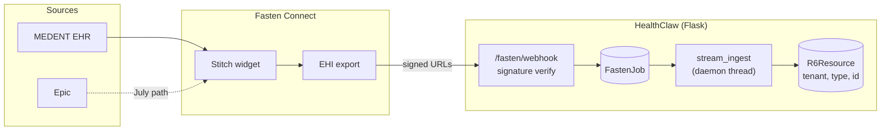
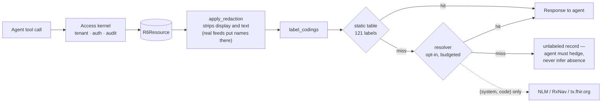
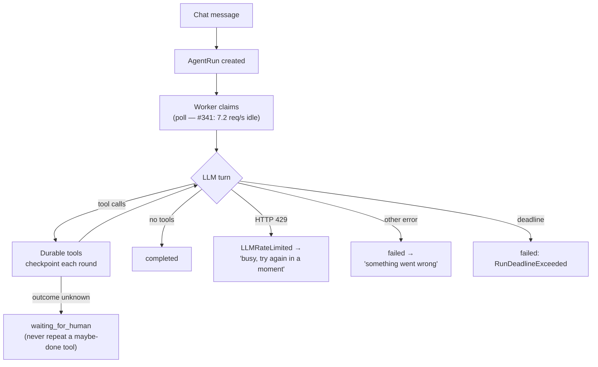
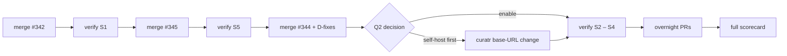

# Plan — 2026-08-04: live-data shakeout, overnight queue, tomorrow's focus

This consolidates the 2026-08-02 architecture audit, the access-kernel refactor
in flight, and the 2026-08-03/04 live findings into one working plan. The
organizing decision: **stop validating against synthetic data.** A real MEDENT
import (698 resources, ingested in 116 seconds) is now loaded, and every gap it
exposed today was invisible to the demo tenant. The live record is the test
oracle from here to Aug 18.

---

## 1. Where we are

**Kernel refactor** (`docs/2026-08-03-access-kernel-spec.md`): slices 1–3, 9,
12 landed. Slices 4–8 gated on the #334 token-strip ruling; 10–11 and 13
queued.

**Today's session, end to end:**

| Finding | Evidence | Disposition |
|---|---|---|
| MEDENT ingest works | 698 ingested / 0 skipped / 0 failed, connect→data in 1m56s | Proven, closed |
| `get_labs` interpreted **zero** observations, always | `json={}` matched no branch of `_observations_from_request` | **PR #342**, green |
| Terminology covers 1 of 26 live condition codes; SNOMED has 0 entries | Measured against tenant `$CAREAGENTS_TENANT` | **#343**; **PR #344**, green |
| Provider 429 shown as "Something went wrong on our side" | `agent_runs.error_class=LLMError`, traceback HTTP 429, no retry | **PR #345**, green |
| Prod log retains ~11 min; worker poll is 100 % of volume; 24/43 worker lines are HealthClaw **502s** | 5000/5000 log lines = claim poll at 7.2 req/s | **#341** |
| Records split across 3 tenants (698 + 194 + 315); agent sees one | DB counts | **#157**, now live |

**Hard self-review of today's PRs found five defects (D1–D5)** — listed in §5
as tonight's first work. All three PRs pass 8/8 CI checks. None merged: a
maintainer approves, that gate is the point.

---

## 2. Lessons learned (each one cost something today)

1. **A control that looks like one thing and quietly does two** — the retro
   defect shape, again: `get_json(silent=True)` returns `None` for both
   "no body" and "malformed body", so my own fix (D1) can't hold the invariant
   its docstring claims.
2. **The demo tenant is a systematically misleading oracle.** The label table
   was curated *from* the demo data, so demo tests can never detect its
   incompleteness. 121 labels looked fine for six weeks; the first real import
   scored 1/26. Coverage must be *measured against live data*, never assumed.
3. **A test that asserts a mechanism exists is not a test that the outcome
   happens.** The Fasten scroll container that couldn't scroll, and the labs
   tests that verified graceful degradation of every input shape except the
   one our own client sends.
4. **Observability is a guardrail.** An 11-minute log window turned a
   two-minute diagnosis into a database session, and hid an app 502ing its own
   worker. If we can't see it, the guarantee doesn't exist operationally.
5. **Honest failure text is a safety feature.** "Something went wrong on our
   side" for a rate limit invites a bug report for a nonexistent defect and
   makes a patient doubt their records.
6. **Separate guardrail failure from data failure.** The agent's hedging
   ("a record is here I can't read") was SAFETY_CORE working *correctly* over
   an empty data layer. Diagnosing it as a guardrail bug would have "fixed"
   the wrong layer.

---

## 3. The system, deconstructed

### 3.1 End-to-end data flow (what was proven live today)

Proven numbers: webhook verified 00:02:39Z → export 00:04:26Z → ingest
complete 00:04:35Z. 698/0/0.

### 3.2 The read path — where today's gaps all lived

The invariant that must survive every change here: **nothing upstream of
`apply_redaction` may reach the response.** The resolver re-labels only from
sources we control, keyed by code. A code's meaning is a property of the code,
not the patient — that is the entire safety argument, and
`test_label_codings_still_refuses_to_carry_upstream_display` pins it.

### 3.3 The agent run loop and its failure taxonomy

Today's incident traced this exact graph: 8 tool rounds (the model looping on
unlabeled results — §3.2's miss branch), then the 429 edge, which collapsed
into the generic `failed` edge because the taxonomy didn't distinguish it.

### 3.4 Patterns in use, by name

| Structure | Established pattern | Why it fits |
|---|---|---|
| `terminology.lookup()` unchanged while gaining cache/budget/network | **Deep module** (Ousterhout) | Callers can't tell the implementation grew |
| Kernel adoption one blueprint per PR | **Strangler fig** | Old paths keep working until each slice is proven |
| Resolver between our domain and public terminology | **Anti-corruption layer** | Public API shapes never leak into resource JSON |
| 8-lookup / 400 ms per-request budget | **Bulkhead** | One slow dependency can't sink a patient read |
| Miss caching (with D2's transient/authoritative split) | **Negative caching** | Unknown codes can't cost a round trip per message |
| Write-guard matrix, strict xfail | **Characterization tests** (Feathers) | Fixes are forced to update the pin in the same PR |
| `_Recorder` / `_Post` scripted providers | **Test seams/adapters** | QA never waits on NLM or the model provider |
| LLMRateLimited ⊂ LLMError | **Error taxonomy over string matching** | Handlers upgrade without knowing the new type |

---

## 4. The live-data shakeout protocol

Purpose: use the already-connected record (`$CAREAGENTS_TENANT`, 698 resources) to
exercise agent behavior, data use, and the end-to-end flow — **without PHI ever
leaving the system.**

**PHI rules for every check:** verification reads *counts, statuses, codes,
error classes, and audit `detail`* (PHI-free by construction). Chat content is
only ever read by Eugene in his own UI. Nothing patient-specific goes into an
issue, log, or this repo.

The trick that makes this measurable server-side: **the audit trail is the
scorecard.** `labs $interpret` writes `interpreted=N flagged=M critical=K` to
`audit_events.detail`; `unlabelled_codes()` reports misses; `agent_runs`
records `error_class` and event counts. We can prove the agent *used the data*
without looking at the data.

| # | Probe (Eugene asks in UI) | Server-side pass signal (PHI-free) | Gated on |
|---|---|---|---|
| S1 | "What do my labs say?" | audit `labs $interpret; interpreted>0`; answer cites actual values incl. cholesterol | #342 merged |
| S2 | "What conditions do I have?" | ≥14/15 ICD-10 codes labelled (`unlabelled_codes()` shrinks); no "cannot read clearly" for coded rows | #344 + enable decision |
| S3 | "What medications am I on?" | 4 meds named via `Medication` deref | tonight's PR |
| S4 | "Do I have any allergies?" | Wording = "recorded but not coded at the source"; **never** absence | tonight's PR |
| S5 | "Give me a timeline of my cholesterol results" (the exact question that failed) | `completed`, or `error_class=LLMRateLimited` + honest text | #345 merged |
| S6 | "What preventive care am I due for?" | care-gaps cites USPSTF/ACIP against real age/sex | already live |
| S7 | Any question | Zero resources from `$OWNER_TENANT` / `ev-personal` in the answer (isolation holds until #157 is *deliberately* unified) | always |
| S8 | — (automated) | Every S1–S6 read has an AuditEvent; tool-rounds-per-question drops vs. today's 8 (loop inflation is the #345 root cause) | harness |

`scripts/shakeout_live.py` (tonight) automates the server side: runs the
audit/count queries read-only, prints a scorecard, exits nonzero on any
regression — same contract as `prod_watch.py`, and honest about what it can't
see (the UI answers, which are Eugene's five minutes).

---

## 5. Overnight goal (autonomous — nothing merged, nothing deployed)

Constraint set: no self-merges, no deploys, no Railway env changes, no new
external calls from prod. Everything lands as green PRs awaiting review.

**Committed:**

1. **D2 (high, blocks #344 merge):** transient resolver failures (server
   unreachable / non-200) must not be cached; only an authoritative
   `valid:false` is a permanent miss. Test: an outage followed by recovery
   resolves the label.
2. **D3:** resolver constructs its engine with a ~1 s timeout so the budget's
   worst case is honest; PR text corrected.
3. **D4:** cap `_CACHE` (the #339 unbounded-growth shape).
4. **D1 (on #342):** distinguish malformed JSON from absent body
   (`content_length`), so the fallback docstring's invariant actually holds.
5. **D5 (on #345):** single `_failure_text` used by worker *and* both
   `app.py` sites; the string literals die.
6. **New PR — medicationReference deref:** `_summarize_bundle` follows
   `medicationReference` → `Medication.code` (tenant-scoped, redacted-then-
   labelled). S3's gate.
7. **New PR — uncoded wording:** resources whose codings carry no
   system/code render as "recorded but not coded at the source", preserving
   never-infer-absence. S4's gate.
8. **New PR — greeting counts:** `_summary=count` totals, not
   `len(first page)`. Kills the fake "50 / 50".
9. **`scripts/shakeout_live.py`** per §4.

**Stretch:** #339 (limiter keyed on client IP); design note for
guideline-grounded condition advice (extend the labs `REFERENCES`/`source`
pattern to ACC/AHA 2018 + USPSTF statin guidance) — *design only*; clinical
thresholds get clinician review before a live demo, same rule as
`LOINC_RANGES`.

---

## 6. Tomorrow's focus

**One 30-minute owner session unblocks everything:**

1. **Quiz decisions (from tonight's review):**
   - Q1: is implicit whole-record `$interpret` a committed API behavior, or a
     deprecation while clients learn to say what they mean?
   - Q2: public-terminology disclosure acceptable for launch, or self-host
     first — and does self-hosting land before Aug 18?
   - Q3: under sustained throttling, fail-fast-and-honest, or park the run
     `waiting` and complete when capacity returns?
2. **Standing gates:** #334 (token strip — rec: uniform), #328, #310.
3. **#157 is now the biggest product decision:** one person's record split
   698/194/315 across three tenants, and the demo shows an agent blind to
   two-thirds of its patient's history. Unify before Aug 18 or scope the demo
   to one tenant — deliberately.

**Then the merge-and-verify ladder** (each rung auto-deploys; run
`shakeout_live.py` + `prod_watch.py` between rungs):

**Definition of done for this phase:** all eight scorecard rows green against
the live record, tool-rounds-per-question measurably down, and every failure a
patient can see telling them the truth.
