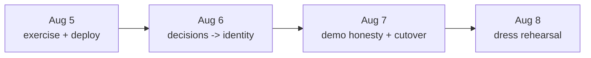

# 2026-08-04 wrap-up: review of the shakeout arc, and the plan to Aug 18

Covers everything from the 2026-08-03 night review through tonight: 19 merged
PRs, one production deploy, four incidents, and the decisions now blocking.
Companion to `docs/2026-08-04-plan-live-data-shakeout.md`, which this closes
out, and `docs/2026-08-02-retro.md`, whose defect shape kept appearing.

## 1. What shipped, grouped by what it proves

| Theme | PRs | The claim it makes true |
|---|---|---|
| The agent reads the record | #342, #344, #347, #348, #349 | Labs interpreted (0 → 186), 26/26 codes labelled, meds named, allergy wording honest, greeting counts real |
| Honest failure | #345, #361, #336 (#362) | A provider 429 and an import in flight are reported as what they are |
| Timeline surfaces | #357, #358 | "Give me a timeline of my cholesterol" answers with a chart, in chat and as an MCP App |
| Security | #354, #307 (#364), #282 (#365) | Rate limit not caller-evadable; step-up tuple destructured; $interpret redacts |
| Ingest integrity | #293/#306 (#363) | Refused records are counted and visible; one bad entry no longer wedges a batch |
| Ops evidence | #350, #356, #359 | A scorecard reads the audit trail; CI rules match their own names |
| Docs and community | #346, #351, #355, #360 | Rulings recorded next to the code they govern; Spanish README vetted |

Deploy state tonight: the Flask app auto-deployed the #363/#364/#365 fixes at
19:18 (verified SUCCESS). CareAgents still runs `b94ae9ea9569`, which predates
#362 — its deploy is manual and gated, and is the first item in the workplan.

## 2. Architecture review

### 2.1 Deep modules gained

Four new modules hide a real decision behind a small surface, which is the
test that matters (Ousterhout, and `.github/REVIEW_STANDARDS.md`):

- `careagents/intake_state.py` — four states, one function, no I/O. The key
  move: `counts` exists only inside the `ready` state. A template cannot
  print a number the classifier withheld. The guard is structural, not a
  comment asking callers to remember.
- `careagents/labs_timeline.py` — analytes are code *sets*, topics map to
  panels, and `trend_plottable` is decided once. The chart cannot draw a
  confident line through part of the data.
- `r6/terminology_resolver.py` — a network call hidden behind the same
  `lookup()` the static table always had. Budgets (8 lookups, 400 ms, 1 s
  timeout, bounded cache) are inside the module, not at call sites.
- `careagents/llm.py` retry — an error taxonomy (`LLMRateLimited`) replaced
  string matching, and backoff policy lives with the classification.

### 2.2 Seams that now exist

- Refusal vocabulary has one home: `REFUSED_OUTCOMES` + `log_refusal()` in
  the ingester, consumed by both ingest paths. The invariant that must not
  diverge — never log the refused id — lives where divergence would start.
- Failure text has one home (`careagents/agent.py`), after D5 proved the
  sync path had its own.
- `_ingest_bundle` returns its counts. A count only a log line can see is
  unfalsifiable; a returned dict is assertable.

### 2.3 Locality debts, named

- Three callers of `_ingest_one` still carry three hand-rolled loops. The
  audit's `ingest_entries()` extraction is deferred by Product decision, not
  forgotten. It becomes urgent the next time a fourth caller appears.
- `ANALYTES` is duplicated between Python and the MCP App's JavaScript,
  pinned by a drift test. Acceptable while there are two surfaces; a third
  surface forces a served JSON contract.
- `r6/labs/routes.py` handlers are closures over the blueprint. Fine at one
  operation; worth flattening if a second lands.
- `chat.html` now carries state logic (intake notice, three greetings). One
  more state and the template should stop deciding and start receiving.

### 2.4 Two self-criticisms on tonight's own PRs

- #362 writes on a GET: `/chat` settles a stale `pending` to `active` when
  records exist. It is idempotent and converges, but it is still a state
  change on a read path — the retro's "one control, two jobs" smell in
  miniature. If it ever grows a third job, move it to the poll endpoint.
- #362 pays three `_summary=count` calls per chat load while a connection is
  pending. Bounded in practice (pending ends), unbounded in the worst case
  (an import that never lands). Acceptable, and stated here so it is a
  decision rather than a surprise.

## 3. QA review

### 3.1 The evidence standard that held

Every fix PR since last night carries a mutation check, not only green
tests: pin the guard's input, delete the rollback, empty the frozenset, drop
`apply_redaction` — and name which tests redden. Three vacuous-test traps
were caught before merge this way: the measure probe that 404'd into a pass,
the scorecard whose stubbed cursor never ran its SQL, and the guard that
read its own docstring as evidence.

### 3.2 Incidents, and what each cost

| Incident | Root cause | The check that now exists |
|---|---|---|
| D5 reported shipped, was not | Pushed to a branch whose PR had merged | Verify ancestry with `git merge-base --is-ancestor`; caught live by an ImportError on the deployed worker |
| Stray Railway project `castage` | `railway up` from an unlinked directory | Runbook now says `railway link` first; deletion still pending (owner) |
| #360 reported merged, was not | Read "auto-merge armed" as "merged" | Report a PR merged only from `state: MERGED`, never from intent |
| "186 observations" quoted, then unreconcilable | Scorecard figure attributed to the wrong tenant | Treated as unverified in the hand-off; live re-run is in the workplan |

The pattern across all four: a report outran its evidence. The countermeasure
is not care but mechanism — every "done" claim in this doc names the command
or check that produced it.

### 3.3 The measured PHI result

The #282 inventory replaced code-reading with measurement: marker-seeded
resources driven through each endpoint. Result: `$interpret` echoed upstream
`display` and `code.text` into the patient-facing path; `$care-gaps` and
`$evaluate-measure` measured clean; the control proved the probe can see a
leak. The fix is live in production as of tonight. Four multi-step sites
(`form_fill`, `sdc/documents`, `smbp`, `curatr`) remain unprobed and are
named as such in the test file.

### 3.4 The open QA gap

Zero agent runs in the last 24 h on either personal tenant. Every
behavioural scorecard row reads SKIP. Nineteen PRs of fixes have not yet
been exercised by one real question. This is the single highest-value
30 minutes available to the project.

## 4. Vision and impact goals to Aug 18

The webinar claim: a patient connects real records and a guardrailed agent
reads them, explains them, and acts — honestly, with every read audited and
every write human-gated. Each goal below is falsifiable on purpose.

- G1 — the five questions answer correctly on live data. Evidence:
  `shakeout_live.py` rows S1–S8 all PASS, none SKIP, plus the owner's
  transcript of the five answers.
- G2 — zero fabrications on any surface in the demo path. Evidence: #310
  either fixed or its page removed from the demo; no unqualified claims
  found in a dress-rehearsal transcript.
- G3 — one patient identity, or a deliberate scope. Evidence: #157 decision
  doc merged; the demo tenant holds the records the demo asks about.
- G4 — guardrail posture holds under the new features. Evidence: Grade A
  conformance; #282 inventory covers all eight sites; #305 closed.
- G5 — the demo survives a full rehearsal. Evidence: `prod_watch` 10/10 and
  the scorecard green, run during the rehearsal, not before it.

## 5. Workplan, Aug 5–8

**Aug 5 — exercise what shipped.**
Owner: run the five questions in CareAgents; approve fork CI on #360; delete
`castage`; authorize the CareAgents deploy of #362. Agent: deploy web and
worker from one stage per the runbook; re-run the scorecard on both tenants
and reconcile the observation counts; file whatever the five answers expose.

**Aug 6 — decide, then build on the decision.**
Owner: rule on #157 (one tenant per human, or a selector) and on #334 (token
strip). Agent: write the #157 decision doc and start the chosen path; resume
kernel slices 4–8 once #334 is ruled; gate or delete `/fasten/demo` (#305).

**Aug 7 — demo honesty and the cutover.**
#310: make the dashboard animation honest or pull the page from the demo.
#264: resolve passkeys across the DNS cutover before the webinar, not after.
#341: switch the worker to long-polling the claim endpoint. #282: probe the
four multi-step sites.

**Aug 8 — rehearse against production.**
Full walkthrough of the webinar path on live data, `prod_watch` and the
scorecard running during it. Defects found here get the remaining ten days;
defects found on Aug 18 get an audience.

## 6. Decisions only the owner can make

1. #157 identity grain — the largest open product decision; everything on
   Aug 6 sequences behind it.
2. #334 kernel token strip — blocks slices 4–8.
3. #310 — is `/r6-dashboard` in the Aug 18 demo? If yes it is stop-ship.
4. CareAgents deploy authorization for #362 (standing rule: gated).
5. Dr. Magan's review of the condition-grounding design (#355) — clinical
   content does not ship on engineering judgment.
