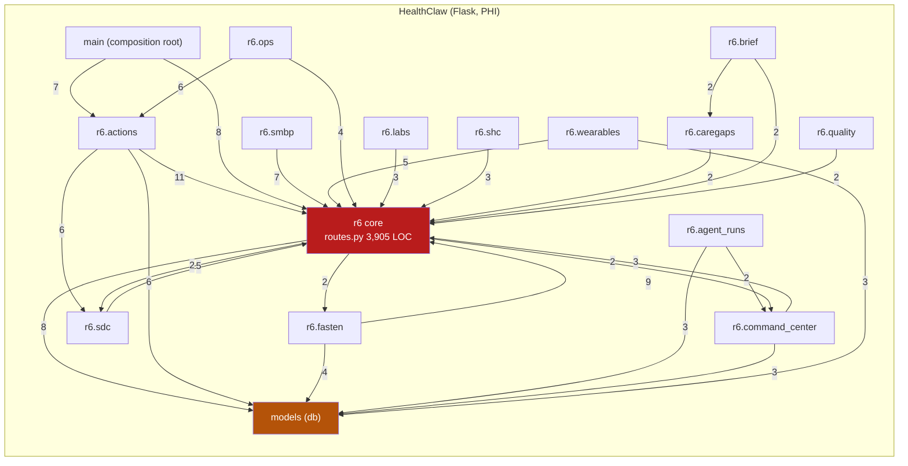
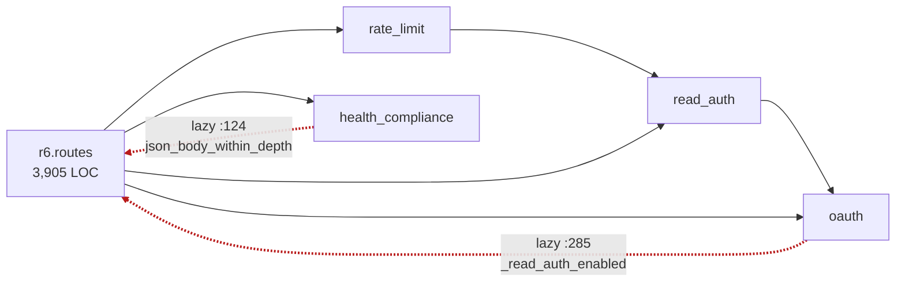

# Codebase graph + scaling review — 2026-08-05

**Question asked:** after a week of 128 commits fixing "a guardrail produced
nothing and the caller read it as an answer" nine times, does the architecture
scale, and where are the single points of failure?

**Method:** an AST import-graph of every production Python module (tests,
migrations, and vendored code excluded), cross-checked by three independent
review passes over the access kernel, the CareAgents service, and the runtime.
Numbers below come from the graph or from counted callsites, not from reading
docs. 172 modules, 325 import edges.

**TL;DR.** The week's 19 merges fixed instances; the graph shows the
generator. Every guardrail guarantee — tenant check, step-up, audit,
soft-delete, honest degradation — is implemented as a convention at N call
sites (audit ×88, tenant header ×55, step-up ×13) instead of a structure at
one, and the access kernel built to change that has 8 of 11 primitives with
zero production callers. Five findings dominate: **(1)** the audit write is
not in the data write's transaction on 88 of 93 sites, so a failed audit
500s *after* the data committed — and two step-up-gated mutators emit no
audit at all; **(2)** the patient-facing "nothing read as an answer"
pattern survives on the review path itself, where an edge 502 tells a
patient their pending form is gone; **(3)** deploys strand in-flight
record imports because the reaper is wired to a CLI production never runs;
**(4)** search silently truncates at 200 with no `next` link — a partial
answer shaped like a complete one, at the API layer; **(5)** the shipped
CareAgents config is SQLite with an 8-request-slot ceiling. All four
import cycles reduce to one ~200-line PR. The plan is 17 items in three
phases, five of them safe before Aug 18.

---

## 1. The map

Red is the god module's package; amber is the shared DB layer. Every arrow
into `r6` core is a blueprint reaching back for a symbol that mostly lives in
`routes.py`.

### Hotspots, by the numbers

| Module | Fan-in | Fan-out | LOC | Reading |
|---|---|---|---|---|
| `models` | 32 | — | — | every module talks to the DB directly |
| `r6.models` | 23 | — | — | same |
| `r6.audit` | **21** | — | — | audit is called from 21 modules, not 1 |
| `r6.stepup` | 13 | — | — | step-up gate called raw from 13 modules |
| `r6.access` (the kernel) | **5** | 8 | 823 | the designated single gate, barely adopted |
| `r6.routes` | 5 | **28** | **3,905** | god module; other modules import *from* it |
| `main` | — | 32 | 417 | composition root — this hub is healthy |

The shape a healthy version of this graph would have: `r6.access` with the
fan-in that `r6.audit` + `r6.stepup` + `models` have today, and `r6.routes`
with fan-in 1 (`main`).

---

## 2. Finding: the kernel inversion (highest structural risk)

`r6/access.py` is the declared single tenant-reader / step-up gate / audit
call / FHIR exit. The graph says the codebase is currently the inverse:

- **8 of the kernel's 11 primitives have zero production callers.**
  `audit`, `fhir_response`, `outcome_response`, `unredacted_response` are
  fully tested and never executed. `require_grant` has exactly one caller
  (`r6/smbp/routes.py:100`).
- **Adoption is deliberately gated** — `tests/test_access_kernel.py:1022`
  pins an allowlist of 5 files, and the gate has opened four times. This is
  good discipline; the risk is not drift, it is *stall*: `r6/access.py` has
  2 commits while the paths it is meant to replace absorbed ~40 fix commits
  this week. Every fix that lands in the un-migrated path widens the gap the
  migration must eventually re-verify.
- **Slices 0–3 and 9 of the 19-slice spec shipped; 4–8 and 10–14 did not.**
  The spec itself predicted this cut line for Aug 18 — the plan is on plan.
  What is *not* on plan is that the week's nine "nothing read as an answer"
  defects all happened in code the kernel was designed to make impossible.
- **Two step-up-gated mutators emit no audit events at all**:
  `r6/command_center` (3 gated writes, 0 audit calls) and `r6/agent_runs`
  (2 gated writes, 0 audit calls). They are also the two modules the spec
  deferred for having no write-guard-matrix row. For a PHI system this is
  the single worst gap in this report: a mutation surface that is
  authenticated but invisible.
- 55 raw `X-Tenant-Id` header reads across 14 modules; 10 modules read it
  with **no validation at all** (`quality:35`, `labs:38`, `caregaps:38`,
  `brief:31`, `command_center:80,131,263`, `agent_runs:98`, `sdc`,
  `smbp/scheduler_routes:48`, `actions/routes:60`).
- `r6/wearables/routes.py` imports four competing access mechanisms in four
  consecutive lines (23–26); `sync_now` uses the kernel, `sync_status` 30
  lines above does not. Half-migration in one screenful.

## 3. Finding: all four import cycles are one small PR

The graph shows one SCC through the auth stack — actually four nested cycles
sharing back-edges, all already deferred (function-local) at runtime:

The two red back-edges exist because three utility symbols live in the god
module. Breaking every cycle is ~200 lines moved, no behavior change:

1. **Move the env predicates** `read_auth_enabled` / `public_tenants` /
   `is_public_tenant` from `r6/read_auth.py:26-40` into `r6/runtime_config.py`
   (they read env vars and nothing else). `oauth.py:285` was importing a
   re-export alias of the first one out of `routes.py`. Also collapses the
   duplicate `is_public` in `r6/command_center/access.py:95`.
2. **Move `json_body_within_depth`** (+ its two pure deps,
   `routes.py:2070-2121`) into a new `r6/body_guard.py`. Its three importers
   all import it lazily today, each with an apology comment.
3. **Move `authenticate_tenant_read`** (`routes.py:250-266`) into
   `r6/read_auth.py` next to the predicate it wraps — or directly into the
   kernel as part of slice 10.

After this, nothing imports from `r6/routes.py` except `main.py`, and the
Workstream-B split of the god module becomes mechanical.

The second SCC (`r6.actions.rails`) is a star, not a chain: the package
`__init__` imports its own submodules for registration side effects while
they import shared transport helpers back from it. The refactor plan already
schedules `_safe_request` for promotion to a repo-wide HTTP seam, which
breaks this cycle as a side effect — do not do it twice.

## 4. Finding: privilege tiers share a module

`r6/routes.py` carries, behind one blueprint: public FHIR CRUD + search,
FHIR operations, AuditEvent query/export/SSE, **and** the privileged
internal surface — `/internal/step-up-token`, `/internal/purge-tenant`,
`/internal/seed`, `/internal/ingest-bundle` — plus the demo loop and MCP
app HTML. A change to any of them risks all of them; a reviewer cannot
tell from the diff header which trust tier is being touched. The split
(§7, R2) should cut along trust boundaries, not just size.

## 5. Finding: CareAgents failure propagation

The week's fixes hold on 23 of 36 client methods: `_send` wraps transport
failure, `_upstream_answered` separates "the engine refused" from "the
gateway timed out," and the mail tri-state is exemplary end to end (a
truthy-string enum so a fake can't read as success, `NOT_SENT` burns the
code so the cooldown can't swallow the retry, `sent: null` when delivery
was unobserved). The worker's claim design is genuinely good: `FOR UPDATE
SKIP LOCKED` plus the Conversation row as a cross-process mutex, lease
heartbeats, and mid-tool death parked as `waiting_for_human` rather than
re-executed.

The same pattern the week spent nine fixes on is still present in four
places, ranked:

1. **SEV-1, the review path.** `fetch_review_page` returns `(status, text)`
   unfiltered; `careagents/app.py:1033-1037` maps *any* non-200 —
   including an edge 502/503/504 — to "This form is no longer awaiting
   review" with a 404. A patient with a live pending form is told it is
   gone, by the approval gate itself. `submit_review` one call later is
   worse: a transport failure raises `HealthClawError` with **no
   errorhandler registered anywhere in careagents/**, so the patient's
   approval decisions die as a bare 500 with no "nothing was approved."
   This is the same defect class as #416/#410, on the same route, fixed on
   the adjacent lines.
2. **SEV-2, history.** `recent_messages` returns `[]` for outage and for
   "new conversation" alike — and it bypasses `_send` entirely. The web
   tier renders every return visit during an outage as a first visit; the
   worker builds the agent's context from it, so the agent silently
   answers with amnesia and tells no one.
3. **SEV-3, the brief.** `fetch_appointment_brief` returns `None` on
   everything; the template renders "Not available from your connected
   records" — a statement about the records, made during an outage. The
   same page gets it right one section down (screening review requires an
   explicit `"ok"`, #381). One page, two postures.
4. **SEV-4, the heartbeat.** One failed lease heartbeat (`worker.py:104`)
   declares the lease lost, no retry — one 25s blip aborts a turn the
   model may already have answered.

### Resilience posture, measured

- **No retry, no backoff, no circuit breaker** on any HealthClaw call.
  One flat 25s timeout for everything.
- **The Anthropic client has no timeout configured** — SDK default 600s,
  inside a 120s run deadline and a 60s lease. A hung provider pins a
  worker slot for ten minutes on a run that died eight minutes earlier.
  (The OpenAI-compatible path *is* configured: 90s, 3 attempts, honors
  Retry-After, refuses to sleep past the lease.)
- **No backpressure signal.** Worker health is presence-only: one live
  worker with 500 queued runs reads "ready," so every turn is accepted
  and times out individually. The system can say "up" or "down" but not
  "busy."
- **The hard ceiling is 8.** `--workers 2 --threads 4` = 8 request slots;
  each SSE chat turn holds one up to 150s. Eight simultaneous chatters
  saturate the web tier including `/healthz` — which then fails readiness
  and can trigger a restart loop.
- **SSE poll amplification:** 0.25s poll × 150s = up to 600 HealthClaw
  calls per browser per turn; the connect page polls at ~1.4 calls/sec
  sustained (`record_count` alone is 6 sequential searches, 150s worst
  case in one request). **Zero caching anywhere** in careagents/.
- **Shipped config is SQLite** for web *and* worker on one file, no WAL,
  no busy_timeout — the one item on this list that converts load growth
  into an outage (locked-database 500s) rather than latency. Postgres
  support exists (`pool_pre_ping`/`pool_recycle`, #384) but
  `config.py:165` deliberately warns instead of requiring it.
- **Dead guarantees:** `conversation_locks.py` (85 LOC) is imported only
  by a test; `MAX_LIVE_CONVERSATIONS` / `CONVERSATION_IDLE_SECONDS` have
  no reader. Both document bounds nothing implements. The daily-turn cap
  is read-then-write with no unique constraint, so concurrent turns leak
  past it.

## 6. Finding: runtime single points of failure

Ranked by blast radius.

### 6.1 The audit write is not in the data write's transaction (89 of 94 sites)

Every FHIR write commits the resource first, then audits
(`r6/routes.py:531-542` create, `:725-735` update). `record_audit_event`
(`r6/audit.py:84-113`) opens its own SAVEPOINT and then calls
`db.session.commit()` — an **ambient commit** that also commits whatever the
caller had pending. If the audit write fails, nothing catches
`AuditWriteError`: the caller gets a 500 *with the resource already
persisted and unaudited*. That is fail-closed on the response and fail-open
on the data — the inverse of what the class docstring claims.

The correct primitive already exists: `add_audit_event` flushes inside the
caller's transaction and never commits. Census: `record_audit_event` 89
sites, `add_audit_event` **5**. The #338 after-flush assertion observes the
audit row honestly now, but it only runs under `TESTING` /
`HC_ASSERT_AUDIT_COMMITTED` — production has no tripwire.

For a system whose constitution says "every FHIR resource access emits an
AuditEvent," this is the top compliance risk in the codebase: the guarantee
holds only when nothing goes wrong, which is precisely when audit matters
least.

### 6.2 Deploys strand in-flight imports, and the reaper never runs

Fasten NDJSON ingest and SHC import run as **daemon threads inside the web
dyno** (`r6/fasten/routes.py:182-191`, `r6/shc/routes.py:238-241`). A
Railway deploy kills them mid-import. The recovery function exists —
`recover_zombie_jobs`, `main.py:131` — but its only callers are a CLI
command and a legacy boot path that `railway.toml` never invokes. Since
`web` auto-deploys from `main`, **every merge that lands during a patient's
import strands that import**, and recovery is a human hitting a retry
endpoint.

### 6.3 `is_deleted` filtering split cleanly along old/new code (#422)

`r6/routes.py` filters `is_deleted` at all 18 query sites. Eleven feature
modules added since — caregaps, labs, sdc, actions/review, form_fill,
context_builder, quality, smbp — have **zero** `is_deleted` references
across 21 query sites. It hasn't detonated because there is no DELETE route
and only Permission-revoke sets the flag today. It is a loaded gun: the
demo-tenant cleanup (#422) or any future delete feature fires it, and
`caregaps` reads soft-deleted Patients straight into the evaluator.

### 6.4 Process-local state and the two-worker multiplier

Postgres is required in production and the rate limiter requires Redis
(`r6/runtime_config.py:129-133`) — good. But: step-up **replay nonces**,
the terminology cache, and the conformance report cache are per-process
dicts; gunicorn runs 2 workers, so any in-memory fallback silently doubles
limits; and `consume_nonce=False` is the *default* (`r6/stepup.py:190`), so
step-up replay protection is opt-in per call site.

Four further hardening items — three configuration fail-open conditions
and one unauthenticated amplification surface — were found in the same
pass. They are **tracked privately and will be published here once
fixed**, following the precedent set by this repo's S-1…S-4 findings,
which were written up publicly only after they were deployed. Nothing in
that set is exploitable without a deployment mistake, and all four are
scheduled in Phase 0/1 of the playbook.

### 6.5 Concurrency and conformance residuals (fileable today)

- **PUT accepts a truthy non-dict body** — POST got the #331 fix
  (`isinstance(body, dict)`, `routes.py:466`); PUT still has `if not body`
  (`:658`), so `PUT` with `[1]` reaches `.get()` → authenticated 500. The
  fix didn't carry across.
- **Optimistic locking is check-then-act.** `If-Match` is compared in
  Python with no `SELECT FOR UPDATE` and no `WHERE version_id = :expected`
  — two concurrent PUTs with the same ETag both pass; last writer wins
  silently. Also `lstrip('W/')` strips a character set, not a prefix.
- **Search does not paginate.** `_count` clamps at 200, the Bundle carries
  an accurate `total` and a `self` link, and **no `next` link exists
  anywhere**. A tenant with 5,000 Observations can see 200 of them. This is
  the API-level twin of the week's defect pattern: a partial answer shaped
  like a complete one.
- **Validation degrades silently** — external validator failure falls back
  to structural checks with only a server-side log line; the caller can't
  tell a validated resource from a structurally-plausible one.
- **MCP manifest carries no `tier` field** — the step-up gate reads the
  in-process registry (fine for MCP transport), but the exported manifest
  that the OpenAI/Gemini bridge consumes has no privilege signal beyond
  hints; the gate cannot be reconstructed from the artifact (#328's goal,
  half-landed).
- `r6/schema_sync.py` is dead code with zero production callers,
  contradicted by its own test suite. Delete it.
  > **Done, 2026-09-04 (#604).** `a66b33f` (#471) deleted it. The path above
  > no longer resolves; it is kept as the record of why, not as a pointer.

## 7. Measured against healthcare/FHIR practice

What the standards expect of a FHIR repository holding PHI, against what
the graph and the three passes measured. "Held" means verified, not
assumed.

| Practice | Expectation | Here | Status |
|---|---|---|---|
| Audit atomicity (ATNA / AuditEvent) | audit row commits with the operation or the operation fails | 88 sites commit data first, audit second, ambient commit; 5 sites do it right | **Gap — top priority** |
| Audit completeness | every access and mutation audited | 2 step-up-gated mutators emit zero events (command_center, agent_runs) | **Gap** |
| Single policy enforcement point | one gate for tenant + scope + audit + exit | kernel built and tested; 8/11 primitives uncalled; 55 raw header reads in 14 modules | **In flight, stalled** |
| Fail-closed configuration | one production posture | prod closes 4 fail-open dev defaults, except the Vercel branch; MCP auth middleware fail-open minus NODE_ENV | **Partial** |
| Tenant id validation | validated at every entry | 4 blueprints fixed (slice 9); 10 modules still read the header unvalidated | **Partial** |
| Search pagination | searchset Bundles with `next` links | accurate `total`, `self` only, hard cap 200, no `next` anywhere | **Gap — silent truncation** |
| Concurrency (If-Match) | atomic version check | check-then-act in Python, no `WHERE version_id`; last writer wins | **Gap** |
| Version history | `_history` / vread or documented absence | overwritten in place, honestly declared in CapabilityStatement | Declared, acceptable |
| Soft-delete consistency | one selector honoring `is_deleted` | old code filters at 18/18 sites, new code at 0/21 | **Gap — latent (#422)** |
| Durable background work | queue + reaper, not request threads | agent_runs has the good pattern; fasten/SHC ingest are daemon threads with a reaper that never runs | **Gap** |
| Honest degradation (patient-facing) | outage ≠ negative clinical claim | 9 fixed this week; 4 remain (review page, history, brief, heartbeat) | **In flight** |
| Backpressure | reject or queue visibly under load | presence-only health; no queue depth; 8-slot ceiling | **Gap** |
| Replay protection | nonces consumed by default | `consume_nonce=False` default, opt-in per site; in-memory outside Redis | **Partial** |
| PHI-free failure text | sanitized errors at every boundary | MCP sanitizer is best-in-repo (allowlisted codes, bounded reads, URL-free constants); careagents D5 single-home | **Held** |
| No PHI in consumer tier | accounts and pointers only | held; session is signed-cookie, replica-safe | **Held** |

The pattern across every "Gap" row: the guarantee exists as a *convention*
enforced at N call sites rather than a *structure* enforced at one. That is
the same generator behind the week's nine defects. The retro's phrase was
"a control that looks like one thing and quietly does two"; the graph's
version is "a guarantee implemented 88 times is a guarantee broken
somewhere."

## 8. The plan

Ordered by risk-to-patients over effort, and split at the webinar
freeze. Nothing in Phase 0 touches clinical logic or interfaces.

### Phase 0 — before Aug 18 (small, contained, each one PR)

| # | Change | Size |
|---|---|---|
| 1 | Review path: apply `_upstream_answered` posture to `fetch_review_page` + `submit_review`; register a `HealthClawError` errorhandler in careagents | S |
| 2 | Carry #331 to PUT: `isinstance(body, dict)` at `routes.py:658` + matrix pin | XS |
| 3 | Anthropic client: explicit timeout < run deadline; worker heartbeat gets one retry | XS |
| 4 | `recover_zombie_jobs` into `railway.toml` preDeployCommand | XS |
| 5 | Brief + history: outage renders as "couldn't check," not "not in your records" / first visit | S |

### Phase 1 — the structural fixes the week's defects were pointing at

| # | Change | Why now |
|---|---|---|
| 6 | The cycle-breaking PR: env predicates → `runtime_config`, `json_body_within_depth` → `r6/body_guard`, `authenticate_tenant_read` → `read_auth` (~200 lines, no behavior change) | unblocks every split of routes.py |
| 7 | Audit atomicity: add audit to command_center + agent_runs first (they have none), then migrate `record_audit_event` → `add_audit_event` per blueprint — this *is* kernel slices 12–13 | the top compliance gap |
| 8 | Resume kernel slices 4–8 and 10–11 | all nine of the week's defects were in un-migrated code; this is the type-level fix deferred to Aug 19 |
| 9 | One shared soft-delete-aware selector (the refactor plan already names it); fixes the #422 class wholesale | close it before any delete feature fires it |
| 10 | Split `routes.py` along trust tiers: internal endpoints out first, then operations | privilege isolation, then size |

### Phase 2 — scale, in the order load will find them

| # | Change |
|---|---|
| 11 | CareAgents → Postgres, flip `config.py:165` to `_require`; SSE ceiling (async worker or thread raise) — these two are the outage-shaped limits |
| 12 | Backpressure: queue depth in `agent_worker_health`; shed at a threshold with an honest "busy, try shortly" |
| 13 | Search pagination with real `next` links; cap `AuditEvent/$export` |
| 14 | Atomic If-Match (`UPDATE … WHERE version_id = :expected`) |
| 15 | Cache the connect-poll reads (`record_count`), add pool_maxsize, per-method timeouts |
| 16 | Move fasten/SHC ingest onto the agent_runs durable-worker pattern |
| 17 | Delete the dead guarantees: `schema_sync.py`, `conversation_locks.py`, the unwired constants — code that documents a promise nothing keeps is how the next "looks like one thing, does two" defect starts |

### What held — worth saying plainly

The composition root is clean. The worker claim design (skip-locked +
conversation mutex + lease + park-don't-replay) is production-grade. The
mail tri-state is the reference implementation of the week's lesson. The
MCP failure sanitizer is the best boundary in the repo. Rate limiting is
Redis-required in production with the XFF and tenant-claim hardening done
right. The kernel itself is well-built and well-tested — the risk is its
adoption rate, not its design. And the discipline that produced this
week's fix quality — pin the defect, fix it, flip the pin in the same PR —
is the reason this review could measure instead of guess.
