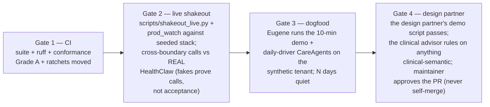
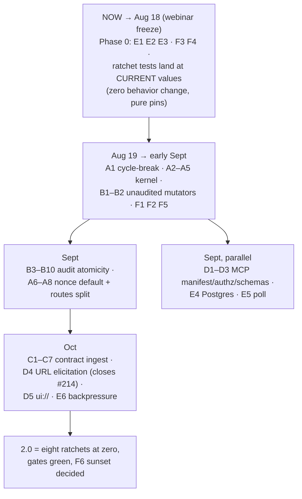

# HealthClaw 2.0 — implementation playbook

How the two 2026-08-05 reviews (graph + pattern-first) become shipped code:
in small chunks, test-first, with dogfood and user-approval gates. This is
the method document; each slice gets its own task-level plan when it
starts.

## 0. The premise: 2.0 is a ratchet, not a rewrite

The research did not find a wrong architecture. It found a right
architecture that nothing *enforces*: four jobs (store, PEP, contract
ingest, thin heads) that all exist and none of which is the only path.
A rewrite would throw away the best-engineered code in the repo (the
newest) to fix the oldest — backwards. So 2.0 is defined not by new code
but by **eight numbers reaching zero and staying there**:

| Ratchet | Today | 2.0 |
|---|---|---|
| `record_audit_event` call sites (post-commit audit) | 88 | 0 |
| Raw `X-Tenant-Id` reads outside the kernel | 55 | 0 |
| Step-up call sites not consuming a nonce by default | 13 | 0 |
| Query sites missing `is_deleted` filtering | 21 | 0 |
| Modules importing `models`/`r6.models` outside kernel+ingest | 23 | ≤3 |
| Lazy imports reaching into `r6/routes.py` | 7 | 0 |
| Patient-visible "nothing read as an answer" sites | 4 known | 0 |
| Kernel adoption allowlist | 5 files | all blueprints |

**The mechanism is already proven in this repo.** The kernel spec pinned
an adoption allowlist in a test and opened it one PR at a time. The write-
guard matrix pinned every write path's behavior. Generalize: every
workstream below gets a *ratchet test* — a CI assertion of the current
count that each PR decrements and no PR may increment. The test suite
becomes the architecture spec. Backsliding becomes a red build, not a
review comment.

```python
# tests/test_ratchets.py — the shape (one per ratchet)
def test_post_commit_audit_sites_only_decrease():
    assert count_callsites("record_audit_event") <= 88  # ← each PR lowers the pin
```

Two rules carried over from what worked this month:

1. **One chunk = one PR ≤ ~200 lines of behavior change**, flipping its
   own characterization pin in the same PR (the §6 rule).
2. **Strangler order**: build the new path beside the old, move callers
   behind the ratchet, delete the old path only when its count is zero.
   Never break the old path while callers remain.

## 1. The six workstreams and their chunks

Chunks within a workstream are sequential; workstreams are parallel
except where the dependency diagram (§4) says otherwise. Every chunk
names its ratchet and its test-first artifact.

### A. The kernel becomes the only path (PEP)

| # | Chunk | Ratchet moved | Test-first artifact |
|---|---|---|---|
| A1 | Cycle-break PR: env predicates → `runtime_config`, `json_body_within_depth` → `body_guard`, `authenticate_tenant_read` → `read_auth` | lazy-imports 7→0 | import-graph test: "nothing imports from r6.routes but main" |
| A2 | Kernel slices 4–5 (wearables 403-dialect, actions ×4 step-up sites) | allowlist +2 | existing write-guard matrix rows flip |
| A3 | Slices 6–8 (routes create/update/share, ingest-context, read_auth scope) | allowlist +1 | matrix rows |
| A4 | Slice 10: header-only tenant reads (routes.py 33 + 6 copies) | tenant reads 55→~15 | per-blueprint tenant matrix |
| A5 | Slices 11a–k: multi-source tenant sites, one PR each | tenant reads →0 | same |
| A6 | `consume_nonce=True` default; exemptions become explicit | nonce sites 13→0 | replay test per exempted site |
| A7 | Grep-guard lands: `X-Tenant-Id` outside kernel = red build | ratchet → tripwire | the guard is the test |
| A8 | Split routes.py by trust tier (internal → own blueprint first) | — | route-inventory pin: same routes before/after |

### B. Audit correctness (same-transaction + coverage)

| # | Chunk | Ratchet | Test-first |
|---|---|---|---|
| B1 | Audit for `command_center` (3 gated writes, currently 0 events) | coverage gap −1 | audit-assertion (#338 after-flush) turned on for these routes |
| B2 | Audit for `agent_runs` — **shipped 2026-09-04**. "2 gated writes" was an undercount: the package has 14 routes and 10 of them are gated on a shared secret rather than step-up, which is also why the ratchet's step-up-only predicate barely covered its own subject. 8 routes audit, 6 are classified as timer chatter with reasons | coverage gap −2; unaudited-mutator set → empty (tripwire) | `tests/test_agent_run_writes_are_audited.py` — per-route classification, wire proof, PHI-free detail |
| B3–B8 | `record_audit_event` → `add_audit_event`, one blueprint per PR (routes, curatr, labs, caregaps, shc/quality, actions/review) | 88→0 stepwise | audit-atomicity matrix: for each write path, assert audit row in `session.new` before commit |
| B9 | Delete `record_audit_event` + its ambient commit | primitive count 2→1 | the ratchet at 0 is the precondition |
| B10 | Enable `HC_ASSERT_AUDIT_COMMITTED` in production once B9 lands | tripwire live | prod_watch check |

### C. Contract ingest (US Core pipeline)

| # | Chunk | Test-first artifact |
|---|---|---|
| C1 | Vendor Inferno g(10) fixtures as `tests/fixtures/uscore/` — the free corpus. Golden-file harness: fixture in → canonical form out | the corpus IS the test |
| C2 | One `to_canonical()` pipeline function: base-R4 hard gate → quarantine table with reason codes | fixtures + hand-broken fixtures |
| C3 | Soft gate: US Core grade as meta tag (`conformant` / `with-DAR` / `off-profile`) — classify, never reject | graded fixtures |
| C4 | Move the display/text strip from read-time into the pipeline (read-time strip stays as defense-in-depth) | leak fixture: PHI-in-display must not reach the store |
| C5 | Route Fasten ingester through `to_canonical()` | fasten NDJSON replay test |
| C6 | Route `$ingest-context`, HealthEx import, SHC through it; delete per-source shape code | ratchet: "modules that parse raw FHIR" → 1 |
| C7 | `validator_cli` full-profile validation as a CI job over the corpus (async, not inline — the reference posture) | CI lane |

### D. MCP 2.0 edge (spec-current)

| # | Chunk | Test-first |
|---|---|---|
| D1 | Manifest: annotations (`readOnlyHint`/`destructiveHint`/`idempotentHint`) + `tier` — closes #328's other half | manifest test pins property-not-names (extend step-up-gate.test.ts pattern) |
| D2 | RFC 9728 `/.well-known/oauth-protected-resource` + `aud` validation + `WWW-Authenticate` challenges (keep the token issuer) | transport-errors tests |
| D3 | `outputSchema` + `structuredContent` on the top 3 read tools, serialized through the schema (allowlist) | schema-conformance test + a display-leak fixture that must fail |
| D4 | URL-mode elicitation for clinical writes → **closes #214**; the action-rail approval page is the URL target; retire `X-Human-Confirmed` | e2e: write without confirmation → -32042 → confirm on page → retry succeeds |
| D5 | Migrate `/mcp-apps/*` HTML to `ui://` templates (PHI-free templates, data per render) | template-has-no-PHI grep test |

### E. CareAgents runtime honesty + posture

| # | Chunk | Test-first |
|---|---|---|
| E1 | Review path: `_upstream_answered` posture on `fetch_review_page`/`submit_review` + a `HealthClawError` errorhandler (SEV-1) | fake gateway-504 test asserting the page does NOT say "no longer awaiting review" |
| E2 | `timeouts.py` constants module: LLM < run deadline < lease; heartbeat one-retry | unit tests on the hierarchy invariant |
| E3 | Brief + history outage states (SEV-2/3): "couldn't check" ≠ "not in your records" | three-state pins per surface |
| E4 | Postgres required in prod (`_require`), WAL/busy_timeout for dev SQLite | runbook QA test exists — extend |
| E5 | SSE → poll with server-suggested `Retry-After` + jitter; cache `record_count` | load test: 10 concurrent chatters don't saturate 8 slots |
| E6 | Backpressure: queue depth in worker health; shed with honest "busy" | fake-queue test |

### F. Subtraction (each its own tiny PR)

F1 `schema_sync.py` · F2 `conversation_locks.py` + dead constants ·
F3 PUT `isinstance` fix (carries #331) · F4 zombie reaper into
preDeployCommand · F5 `is_deleted` shared selector (21 sites → one
`live_resources(tenant_id)` query helper, ratchet to 0) · F6 openclaw
sunset **after** a hermes-parity dogfood week proves the standards path
covers it (measure, don't assume).

## 2. The TDD protocol, by chunk type

Three chunk shapes, three test-first disciplines — all already practiced
in this repo, now stated as the rule:

**Defect chunk** (E1, F3): write the failing test that *is* the defect
(the gateway-504 test), watch it fail, fix, watch it pass, mutation-check
(revert the fix in a scratch worktree, confirm the test reddens —
`PYTHONDONTWRITEBYTECODE=1`). The diff is the defect.

**Migration chunk** (A*, B*): characterization first — pin current
behavior including the wrong parts (strict-xfail for the wrong parts),
migrate, flip the pins in the same PR. The write-guard matrix is the
template; A and B extend it with a tenant matrix and an audit-atomicity
matrix. Rule from the #409 incident: before pinning a wrongness, check no
in-flight PR fixes it (issue #414's process rule).

**New-boundary chunk** (C*, D*): contract tests from external truth —
Inferno fixtures for ingest, the MCP spec's schemas for the edge. Golden
files, not hand-written expectations, so the test corpus is arguably
right rather than self-confirming. Hand-break copies of fixtures for the
rejection paths.

And the standing rule for all three: **the ratchet test is part of the
chunk.** A chunk that improves the code but doesn't move its number
didn't happen, architecturally.

## 3. The approval ladder: dogfood before design partner, design partner before done

Four gates per chunk batch (not per PR — per batch that changes behavior
someone can feel):



- **Gate 2 is non-negotiable for anything touching careagents↔engine**,
  because those tests fake the client (the CLAUDE.md trap: ids don't
  transfer, rejection is silent).
- **Gate 3 (dogfooding) has a definition**: the owner uses the real
  surfaces on synthetic data — the 10-minute demo script start-to-finish
  plus normal CareAgents use — and the batch sits in that state for a
  few quiet days before the next batch stacks on it. Demo-script
  breakage is the canary; it caught #415 once already.
- **Gate 4 (user approval)**: the design-partner physician is the acceptance tester for
  patient/clinician-visible behavior — their common-use-case demos are the
  acceptance suite; formalize each as a recipe-style artifact (Goose
  pattern: versioned YAML task with declared tools + expected output
  shape) so "her demos still work" is checkable before she ever sees a
  regression. the clinical advisor gates clinical semantics (the #423 lesson:
  reasons about a record no one evaluated). The maintainer-approval rule
  stays absolute.

Cadence: keep the sprint structure that produced the last three weeks
(CTO design pass → Dev in worktree → adversarial QA → Product review),
one workstream-batch per sprint, and a one-line **ratchet report** per
sprint close: eight numbers, direction, blockers.

## 4. Sequencing



Why this order and not another:

- **Phase 0 is pins + patient-visible honesty only.** Landing the
  ratchet tests at *current* values before Aug 18 costs zero risk and
  means the freeze can't silently regress the numbers.
- **A before B**: audit migration wants `require_grant`/kernel plumbing
  in place per blueprint, or you touch every blueprint twice.
- **B before C**: the ingest pipeline writes resources; write it against
  the corrected (in-transaction) audit primitive so C never couples to
  the deprecated one.
- **D4 (URL elicitation) waits for D2 (authz)** because the elicitation
  page must be identity-matched to the token's subject — that's the
  anti-phishing requirement in the spec.
- **F6 (openclaw sunset) is last** and gated on a measured parity week,
  not on enthusiasm.

## 5. Definition of done for 2.0

1. All eight ratchets read zero and are tripwires (increments = red CI).
2. Grade A conformance held on every merge in between (it gates CI
   already — the constraint is it *stays* the constraint).
3. The 10-minute demo and the design partner's recipe suite pass on the deployed
   stack, verified live, not from fakes.
4. The three tolerated gaps have owners and dates, not vibes: #423
   (clinical ruling), #413 (curatr token), openclaw sunset decision.
5. The two review docs and this playbook live in `docs/` — committed,
   because the repo's rule is that guidance that matters is published,
   not resident in one person's context window.
