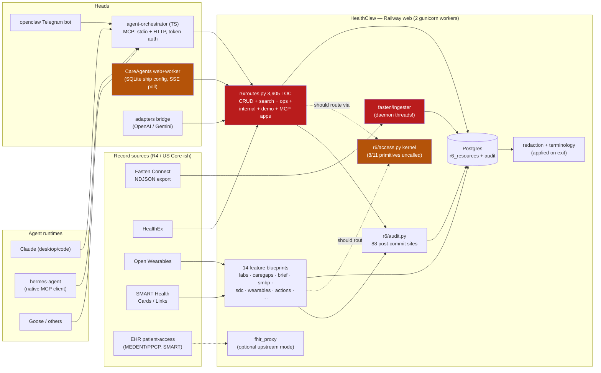
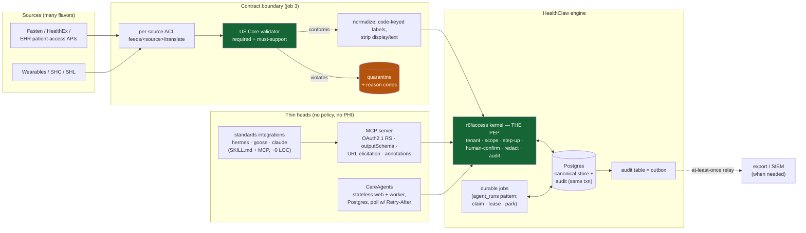
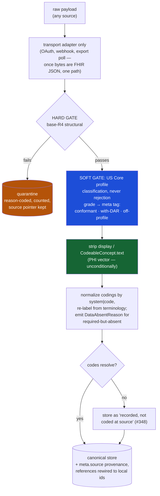
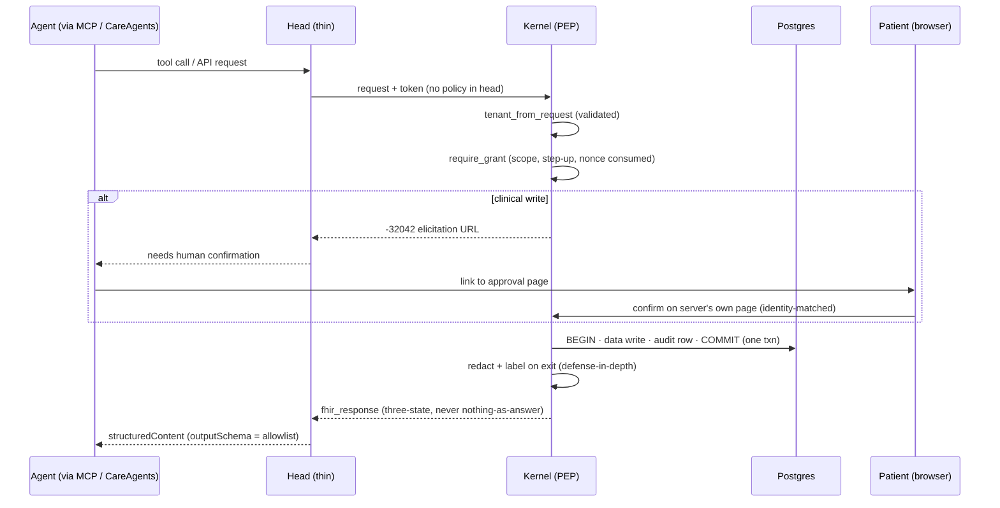

# Pattern-first architecture review — 2026-08-05

Companion to the same-day graph review (import graph, 172 modules, three
measured review passes). That document found the defects; this one asks the
structural question: **is each component the simplest thing that does its
job, and does the whole match how modern agentic + healthcare platforms are
built?** External references researched for this review: hermes-agent (Nous
Research), Block's agentic-app patterns, the current MCP spec direction,
stateless-tier practice, headless data platforms, US Core/USCDI as an ingest
contract, and the open-source healthcare connectors (Medplum, Metriport,
Fasten, Aidbox).

**TL;DR.** First principles reduce the system to four jobs: canonical
store, policy enforcement point, contract-normalizing ingest, thin heads.
All four already exist in the codebase; none is yet the *only path*, and
that gap is where last week's nine defects lived. The external references
converge on this design from three directions: Block's Buzz makes the
audit trail the data model with owner attestation ("authorization does
not erase authorship") — our step-up + human-confirm + AuditEvent thesis
productized; the MCP spec's URL-mode elicitation is the standardized
closure of known gap #214, and `outputSchema`-as-allowlist is the
type-level end of the #282 display-leak family; and the US Core contract
holds for our scope (all eight consumer data classes stable since USCDI
v1) with one amendment — the spec's own tolerances mean profile
validation classifies, never rejects. Component verdicts: the newest
code is the best-engineered (`agent_runs` is the reference pattern;
`hermes/` is the integration model at ~0 LOC); the over-engineering
lives in `curatr` (fix path unreachable), `openclaw` (2,100 LOC doing
what standards do declaratively), and the kernel's 8 uncalled
primitives; the under-engineering is one file, `routes.py`. Work is
consolidation, not invention.

---

## 1. First principles: what this system irreducibly is

Strip away every feature and four jobs remain:

1. **A canonical per-tenant health record store.** Small, boring, correct.
2. **A policy enforcement point (PEP)** on every access: tenant isolation,
   scope, step-up, human confirmation, redaction, audit. This is the
   product. Everything the webinar sells — Grade A, verifiable guardrails —
   is this box.
3. **A contract-normalizing ingest boundary**: many source flavors in, one
   canonical shape out.
4. **Heads**: MCP server, consumer app, bots — thin delivery surfaces that
   hold no PHI and re-implement no policy.

Every finding in the companion review is a violation of this decomposition:

- Policy implemented 88 times instead of once → audit gaps, tenant-read
  variance, step-up drift. Job 2 leaked into every blueprint.
- Free-text `display` leaks, "could not look it up" confusion, per-source
  quirks → Job 3 is being done at *read* time (redaction on exit) instead of
  *write* time (normalize at ingest), so every reader re-solves it.
- CareAgents holding retry/timeout/error policy per call site → the head is
  re-deciding things the boundary client should decide once.

The architecture is not wrong. It is **right and unenforced**: the kernel
exists (job 2), the ingester exists (job 3), the heads mostly hold no PHI
(job 4). The gap between "exists" and "is the only path" is where all nine
of last week's defects lived.

## 2. The system today, end to end

Red: measured structural problems. Amber: right component, wrong posture.
The dashed "should route via" edges are the kernel adoption gap; the solid
edges around it are today's truth.

## 3. Component verdicts

First-principles test applied to each: *what job does it do, is it the
simplest structure that does that job, and is its complexity spent where
the risk is?* Verdicts: **over-built** (complexity ahead of need),
**right-sized**, **under-built** (need ahead of structure), **mis-aimed**
(right size, wrong place or default).

### The engine (HealthClaw)

| Component | LOC | Job | Verdict | Evidence-based reasoning |
|---|---|---|---|---|
| `r6/access.py` kernel | 823 | the PEP | **over-built today, right tomorrow** | 11 primitives, 8 with zero callers, 2 commits vs ~40 landing in code it should replace. The design is good; building all 11 before adopting 3 was inventory. First principles: a PEP earns existence by being *the only path* — until adoption, it is a second implementation of every guarantee, i.e., risk. Fix by adoption, not redesign. |
| `r6/routes.py` | 3,905 | everything | **under-built** | Eight jobs, four trust tiers, one module. The only component where more structure is unambiguously needed. |
| `r6/audit.py` | ~200 | audit write | **mis-aimed** | Two primitives; the wrong one (post-commit, ambient-commit) won 88–5. The simple fix is a default, not a framework: `add_audit_event` in the caller's transaction, one deprecation shim. |
| `r6/stepup.py` | ~250 | write elevation | **mis-aimed** | Sound HMAC design; `consume_nonce=False` default makes replay protection opt-in at 13 call sites. Flip the default, delete the parameter at call sites that don't need an exemption. |
| `r6/redaction.py` | ~300 | PHI minimization on exit | **right-sized** | Profile-driven, docstring-is-the-spec, boringly effective. Keep exactly as is; it becomes defense-in-depth (not the primary control) once ingest normalizes. |
| `r6/terminology.py` + resolver | ~400 | code→label, never display | **right-sized** | Static table + opt-in runtime lookup with a per-request budget and deliberate no-DB-cache reasoning. One mismatch (5s timeout vs 0.4s budget). This is what simple-and-effective looks like. |
| `r6/validator.py` | 752 | structural validation | **mis-aimed** | Right-sized checks, wrong failure mode: external-validator loss silently downgrades to structural. Honest degradation is this repo's own religion — the validator should confess in the OperationOutcome. |
| `r6/conformance/` | 1,379 probes | verifiable guardrail claims | **right-sized, wrong exposure** | Unusual and strategically valuable (a partner can *prove* the guarantees). But it is an unauthenticated in-process write amplifier with a cache bypass. Lock it; don't shrink it. |
| `r6/curatr.py` | 1,173 | data-quality engine | **over-built** | Rich evaluation + fix + Provenance pipeline whose apply-fix path is unreachable in production (no `audience='curatr'` token minting, #413). Shipped ahead of its auth story and its user. Freeze feature growth until $curatr-apply-fix has a caller. |
| `r6/fhir_proxy.py` | 839 | guardrails over an external FHIR store | **strategically under-valued** | This is the headless thesis in embryo: policy layer over *any* store (HAPI, Epic sandbox). If the platform's future is "the guardrail layer, store optional," this component is the future — currently 15 broad excepts and no owner. Decide: elevate or excise. |
| `r6/agent_runs/` | ~1,400 | durable agent execution | **right-sized — the reference** | Claim via `FOR UPDATE SKIP LOCKED`, conversation-row mutex, leases + heartbeat, park-don't-replay on ambiguous tools, event log. This is the modern durable-execution pattern implemented small. Other components should copy it, not invent. |
| `r6/fasten/` ingest | ~900 | source→store | **under-built** | Half the durable pattern (jobs table, retry endpoint) with daemon-thread execution and a reaper production never runs. The finished version of this component already exists one package over (`agent_runs`). |
| `r6/command_center/` | 1,440 | ops dashboard | **under-guarded** | 853-LOC projector is honest (pure functions over durable tables). But 3 step-up-gated writes, 30 tenant filters, 0 audit events. Privilege without evidence. |
| 8 thin blueprints (labs, caregaps, brief, smbp, sdc, wearables, shc, quality) | ~200–650 ea | features | **right-sized individually, wrong collectively** | Each is small and readable. Collectively they hand-roll tenant+audit+error 8 ways — the convention-vs-structure problem. They are the kernel's adoption backlog, nothing more. |

### The heads

| Component | Job | Verdict | Reasoning |
|---|---|---|---|
| `services/agent-orchestrator` (MCP) | agent-facing PEP edge | **right-sized, one gap** | The failure sanitizer (allowlisted codes, bounded reads, URL-free constants) is the best boundary in the repo. Gaps vs current MCP direction: static bearer token (spec has moved to OAuth 2.1 resource-server), manifest carries no tier, and HTTP transport session state should stay stateless. |
| `careagents/` web | consumer head | **mis-aimed runtime** | Product shape is right (no PHI, pointers, signed cookies). Runtime posture is not: SQLite ship config, 8 request slots held by 150s SSE turns, zero caching, 600s LLM default inside a 120s deadline, dead lock module. The head is thin in data and thick in policy — exactly backwards from the target. |
| `careagents/worker` | durable turn executor | **right-sized** | Rides `agent_runs` properly. One brittle spot (single heartbeat failure = lost lease). |
| `openclaw/` bot (991 LOC) + `scripts/bot_commands.py` (1,100) | Telegram gateway | **over-built for its future** | Code-heavy custom integration whose capabilities the hermes path gets via configuration (skills + SOUL.md + native MCP). Two thousand lines maintaining what the standards path does declaratively. Sunset candidate once hermes parity is confirmed. |
| `hermes/` | agent-runtime integration | **right-sized — the pattern** | Integration by open standards (SKILL.md, MCP, persona file) rather than by code: ~0 LOC of Python, an installer, and config. This is what every future integration should look like. |
| `adapters/healthclaw_bridge.py` | OpenAI/Gemini function-calling | **watch** | Justified while those ecosystems lack MCP; becomes deletable as MCP adoption spreads. Keep it thin; never let policy in. |
| `services/shl-server` | SMART Health Links | small, standards-shaped | fine |

### The pattern in the verdicts

Complexity in this codebase correlates with *when* a component was built,
not with the risk it guards. The newest infrastructure (`agent_runs`,
kernel, MCP sanitizer, mail tri-state) is the best-engineered; the oldest
(routes.py, openclaw, curatr's reach) carries the accumulation. That is a
healthy trajectory — the team's current instincts are right — and it means
the work is consolidation onto the good patterns, not invention of new ones.

## 4. The contract thesis: R4 + US Core as the ingest boundary

The owner's thesis: incoming FHIR comes in many flavors but will
ultimately be R4 + US Core / USCDI shaped, so design for the contract and
skip per-source rules. **Research verdict: the thesis holds, with one
amendment** — design for the contract's *stated tolerances*, because three
of them are part of the specification itself.

### What the contract guarantees

- US Core elements come in three tiers: **mandatory** (always present),
  **must-support** ("populate if you have it; receiver never errors on
  absence"), and additional-USCDI. The receiver rules are pre-written:
  a missing must-support element means "not present at the source,"
  nothing more.
- **All eight data classes a consumer app cares about — allergies, meds,
  problems, labs, vitals, immunizations, notes, procedures — have been in
  USCDI since v1 (2020).** Growth since is additive and at the edges
  (v2: SDOH/SOGI/encounters; v3: coverage + health-status assessments).
  The contract for our scope has been stable for six years.
- Strong vocabulary bindings (LOINC, RxNorm, SNOMED, CVX, UCUM) are the
  contract's real gift: they make **code-keyed** normalization viable
  with zero per-source rules — which is precisely the
  `r6/terminology.py` design, independently validated.
- A free conformance harness exists: HL7 `validator_cli` with the
  `hl7.fhir.us.core` package, plus Inferno's g(10) test-kit fixtures as
  a corpus of "what certified servers must emit."

### The amendment: three tolerances are in the spec

1. **The legacy-data exemption.** ONC explicitly does not require data
   originating from outside systems to be mapped to USCDI terminologies.
   A certified endpoint can lawfully serve historical records that are
   structurally R4 but semantically off-profile. Off-profile data from a
   certified source is *routine*, not exceptional — so profile
   validation must classify, never reject.
2. **Must-support silence.** You cannot distinguish "source has none"
   from "source didn't map it," and many sources never send
   DataAbsentReason at all (an ONC carve-out). The three-state
   discipline this repo learned the hard way is the contract's own
   posture.
3. **Free text is unconstrained.** No profile version constrains
   `display`, `CodeableConcept.text`, or narrative. The repo's
   non-negotiable (never preserve upstream display; label by code) is
   the correct defense and nothing in certification replaces it.

Plus: version skew is *within* the contract, not per-source — US Core
3.1.1 through 8.0.1 are live concurrently, and US Core 8.0.1 enters
g(10) testing **Aug 13, 2026**, five days before the webinar.

### How the references split, and where we land

Medplum and Aidbox validate at write (base always, profile opt-in via
`meta.profile`); Metriport canonicalizes at ingest (convert, code-hydrate,
dedupe, `meta.source` provenance); Fasten Connect — our own upstream —
passes source R4 through **unmodified**, so the entire conformance burden
lands on us, the receiver. **Nobody hard-gates ingest on US Core.** The
aggregators' converged pattern is the thesis: receiver-tolerant,
code-keyed, one pipeline.

The per-source rules we avoid writing are replaced by exactly three
generic mechanisms: **a conformance grade** (stored as a meta tag:
`conformant` / `conformant-with-DAR` / `off-profile`), **a display
strip**, and **a quarantine** (for base-R4 structural failure only).
Full-depth profile validation runs async/CI with `validator_cli`, not
inline — matching all five reference implementations.

### Calibration: the audit-transactionality claim

The companion review calls the post-commit audit write its top compliance
risk. The research sharpens this honestly: **HIPAA requires durable,
tamper-resistant, 6-year-retained audit records — not same-transaction
writes** — and both Medplum and Aidbox use async/outbox delivery, with
IHE ATNA's architecture being "emit at the access point, deliver durably
to a separate repository." So the defect is not "we differ from a
regulation"; it is that the current shape delivers the *worst of both
postures*: the request fails (strict) while the data commits unaudited
(lax), plus an ambient commit of unrelated caller state. Same-transaction
`add_audit_event` remains the right fix at our scale — it is the simplest
mechanism that guarantees no unaudited PHI access, and the audit table
then doubles as the outbox (§5) if an external audit repository ever
materializes. Stricter than the regulation, and cheaper than the
alternatives. What changes is only the framing: fix it as engineering
correctness, not as compliance emergency.

## 5. What the agentic-platform references teach

### hermes-agent (Nous Research)

One agent core, many surfaces: a single `AIAgent` loop serves CLI, gateway,
batch, and API, with 25+ platform adapters normalizing every channel into
one `MessageEvent`. Tools live in a **self-registering registry with one
dispatch choke point** — structurally the same bet as `r6/access.py`, made
by an unrelated team. Skills are `SKILL.md` files (agentskills.io, the
open standard this repo's `skills/` already ships) with progressive
disclosure and a learning loop that writes new skills from experience.

Two direct implications for us. First, the `hermes/` integration folder is
the right model: **~zero code, integration by standards** (SKILL.md + MCP
+ a persona file) — measured against it, `openclaw/` + `bot_commands.py`
is 2,000 lines maintaining by hand what the standards path gets by
configuration. Second, Hermes as an MCP client auto-reconnects, treats
tool descriptions as the entire discovery surface, and may filter tools
client-side — so **server-side per-call auth is the only auth**, which is
already this repo's posture; keep it.

Notably: neither Hermes nor Goose is stateless-horizontal. The agent tier
is deliberately a stateful process with pluggable *execution* isolation.
The stateless-scale discipline belongs to the consumer web tier, not the
agent tier — don't import horizontal-scale complexity where the references
deliberately keep state.

### Block: Buzz + Goose + ACP

Buzz (launched 2026-07-21, Apache-2.0) is the strongest external
validation of this platform's core thesis. Its substrate: every message,
patch, and approval is a **cryptographically signed event in one
append-only log — the audit trail *is* the data model**, not a side
effect. Agent identity is separated from the harness: the agent holds its
own keypair, and an **owner-attestation layer** has the human's key sign
narrowly-scoped authorizations for the agent's key. Their phrase:
*"authorization does not erase authorship."* That is this repo's
step-up-token + human-confirmation + per-event AuditEvent design,
restated by an unrelated team as the foundation of a whole product — and
it is exactly the agent-trust extension Health Bank One proposed collaborating
on. The market is converging on the thing the guardrail stack already
does; the gap is that Buzz makes it *structural* (an event cannot exist
unsigned) where ours is *conventional* (88 call sites remember to audit).

Goose contributes the **recipe** pattern: a task as a versioned YAML
artifact — instructions, typed parameters, declared MCP-server
dependencies, schema-validated output. Block reports recipes carried
Goose to ~60% internal adoption. Our demo scripts and clinician packets
are informal recipes; formalizing the 10-minute demo and the design partner's
common-use-cases as recipe-style artifacts would make them versioned,
parameterized, and shareable instead of prose.

### Consumer open-source platforms (Cal.com, Supabase, Plausible, Maybe)

The convergent stack: magic-code-first auth with passkeys layered after
first login (**careagents already implements exactly this**); one
row-keyed Postgres for multi-tenancy, policy enforced at the data layer;
background work as a DB queue + workers from the same image with
idempotent materialization (**agent_runs already implements exactly
this**); an internal API split from a versioned public API; and hosted +
self-hosted running **the same image**, diverging by license flag, never
by fork. CareAgents' deviations from this stack are precisely its
findings list: SQLite where the pattern says one Postgres, per-process
limiter state where the pattern says data-layer enforcement.

### The MCP spec's direction (2025-11-25 stable; 2026-07-28 RC)

The spec has moved, and it moved *toward* this repo's architecture in some
places and *past* it in others:

| Spec direction | Where we stand |
|---|---|
| **Stateless core** (2026 RC deletes sessions from the protocol; auth on every request) | already our posture — keep; never add session state to the TS server |
| **OAuth 2.1 resource server** (RFC 9728 `/.well-known/oauth-protected-resource`, audience-validated tokens; static bearer is below floor for network-exposed servers) | gap: `MCP_AUTH_TOKEN` is a static bearer. Smallest fix: keep the issuer, add the well-known doc + `aud` validation + `WWW-Authenticate` challenges |
| **Tool annotations as UX, server-side enforcement as truth** ("clients MUST consider annotations untrusted") | our posture already (Flask gates writes) — but annotations + a `tier` field belong in the manifest (#328's missing half) |
| **Structured tool output** (`outputSchema` + `structuredContent`) | gap, and a big one for PHI: an output schema built from named fields is a **redaction allowlist** — an upstream `display` that isn't in the schema cannot ride along. This is the type-level fix for the #282 defect family, at the protocol layer |
| **URL-mode elicitation** (SEP-1036: server returns `-32042` + a URL; the user confirms on the server's own authenticated page, identity-matched, invisible to the LLM) | this is the standardized wire form of our action-rail approval endpoint — and the principled *replacement for the `X-Human-Confirmed` header*, i.e., the closure of known gap #214 |
| **Tasks** (poll-based long operations, server-suggested intervals, auth-context-bound) | protocol twin of the `agent_runs` claim-poll design; adopt when clients support it |
| **Sampling: deprecated** | we never built on it — nothing to do |
| **MCP Apps** (`ui://` pre-declared templates, sandboxed render) | our `/mcp-apps/*` HTML surfaces predate the extension; migrating to `ui://` templates separates presentation from PHI (template ships clean, data arrives per-render) |

### Stateless + headless practice, right-sized

The consensus for a platform this size, from the SRE/12-factor literature:

- **Timeout hierarchy as a constants module**: every dependency timeout <
  handler deadline < LB timeout, in one grep-able file. Our two worst
  findings (600s LLM default inside a 120s deadline; 150s `record_count`
  inside a 180s gunicorn worker) are both violations of this one rule.
- **Retry at one layer only**, 2–3 attempts, jittered, with a ~10% retry
  budget. Today careagents retries nowhere (one-shot everything) and the
  LLM path retries at the SDK layer *and* the app layer on the OpenAI
  path — both wrong in opposite directions.
- **Circuit breakers: don't.** At this scale the guidance is explicit —
  timeouts + capped retries + fail-fast readiness deliver the protection;
  a ten-line consecutive-failure counter per dependency is the whole
  pattern if one hot third-party dependency (Bland/Twilio, an EHR
  endpoint) starts hanging. Anything more is over-engineering.
- **Poll, don't hold.** Short-poll with server-suggested `Retry-After` +
  jitter is the endorsed small-scale pattern; MCP itself moved there.
  CareAgents' 0.25s SSE poll ×150s is the anti-pattern twin: a held
  connection *and* a hot poll.
- **Postgres for everything at this scale** — sessions, nonces, counters,
  job claims (`SKIP LOCKED`), outbox. We already require Redis for rate
  limits (built, keep it), but new state should default to Postgres, not
  grow the Redis surface.
- **The headless rule, mechanically enforced**: *no head imports the
  storage layer* — heads call the kernel/API client only. One CI grep
  turns the whole headless thesis from a review comment into a build
  failure. (The graph shows today's violations precisely: `careagents` is
  clean over HTTP; inside the engine, 23 modules import `r6.models`
  directly.)
- **Audit-table-as-outbox**: the same-transaction audit row is not just
  compliance — it is already the outbox for any future SIEM/export
  stream. Fix 6.1 of the companion review and the export architecture
  falls out for free. Never dual-write.

## 6. Target architecture

Three diagrams: the end-to-end target, the ingest contract pipeline, and
the guarded request path. Nothing here is speculative — every box either
exists today or is named in the phased plan; the diagrams show where the
existing pieces *go*, not new inventions.

### 6.1 End to end

The two green boxes are the same idea at two boundaries: **validate once
at the edge, then trust the contract inside.** The kernel does it for
access; the US Core validator does it for data. Everything between them
stops defending.

### 6.2 The ingest contract pipeline (replaces per-source rules)

Two rules the references converged on and this diagram encodes: **the
hard gate is base-R4 only** (a certified endpoint can lawfully serve
off-profile legacy data, so US Core violations are a *grade*, not a
rejection — quarantining them would silently drop real records, a
patient-safety bug), and **read-side code assumes only the mandatory
floor**, treating every must-support element as optional.

Note what this pipeline is: the week's defect fixes (#282 display echo,
#348 source-uncoded, #377 skipped-type naming, #379 free-text blame)
**arranged as one pipeline instead of scattered as patches**. The
contract doesn't add new rules — it gives the existing rules one home
and one order, so the next source doesn't re-litigate them.

### 6.3 The guarded request path (every head, every read/write)

Every annotation on this sequence is a shipped decision or a filed issue:
the validated tenant read is kernel slice 9 (done for 4 blueprints), the
consumed nonce is the `consume_nonce` default flip, the one-transaction
write+audit is companion-review finding 6.1, URL elicitation closes #214,
and `outputSchema`-as-allowlist is the protocol-level end of the #282
family.

## 7. Over-engineering audit: delete, freeze, don't-build

First-principles rule applied: complexity is justified only by a caller
that exists or a risk that is live.

**Delete now** (code documenting promises nothing keeps):

> **Status checked 2026-09-04 (#604).** Three of the four landed in `a66b33f`
> (#471): `r6/schema_sync.py`, `careagents/conversation_locks.py` and the two
> `careagents/app.py` constants are all gone, so those paths no longer
> resolve. **`scripts/export_healthex_legacy.py` is still in the tree** — that
> item was not carried out and is still open.

- `r6/schema_sync.py` — zero production callers; contradicted by its own
  test suite.
- `careagents/conversation_locks.py` (85 LOC) — imported only by a test;
  serialization lives in the engine's claim now.
- `careagents/app.py:67-68` dead constants (`MAX_LIVE_CONVERSATIONS`,
  `CONVERSATION_IDLE_SECONDS`) — bounds nothing implements.
- The demo-loop route's residue and `scripts/export_healthex_legacy.py`
  (1,081 LOC, superseded) — after confirming no caller.

**Freeze** (stop investing until a precondition is met):

- `r6/curatr.py` feature growth — until `$curatr-apply-fix` has a
  production caller (#413's token design). An evaluation engine whose fix
  path is unreachable is a demo, not a feature.
- `openclaw/` + `scripts/bot_commands.py` (~2,100 LOC) — until the hermes
  path is confirmed at parity; then sunset. Integration by standards
  (SKILL.md + MCP) made code-per-channel obsolete this year.
- Kernel primitive expansion — no 12th primitive until the existing 8
  unused ones have callers. Adoption, not construction.
- New R6-ballot resource support — the market contract is R4 + US Core
  (§4); R6 features are differentiation only where a guardrail needs
  them (Permission is one; most are not).

**Don't build** (temptations the references explicitly warn against):

- A message bus / Kafka / CDC — the outbox pattern on Postgres with the
  existing claim-poll worker covers every current propagation need.
- Circuit-breaker or service-mesh libraries — the ten-line counter.
- WebSockets for chat/progress — polling with `Retry-After` is endorsed
  at this scale and matches MCP's own direction.
- Per-tenant databases or sharding — one row-keyed Postgres is what
  Cal.com-scale platforms run; RLS is available if defense-in-depth is
  wanted below the kernel.
- A second "unified" agent framework — Hermes/Goose/Claude connect via
  MCP already; the platform's job is to be the best MCP citizen, not to
  own the agent loop.
