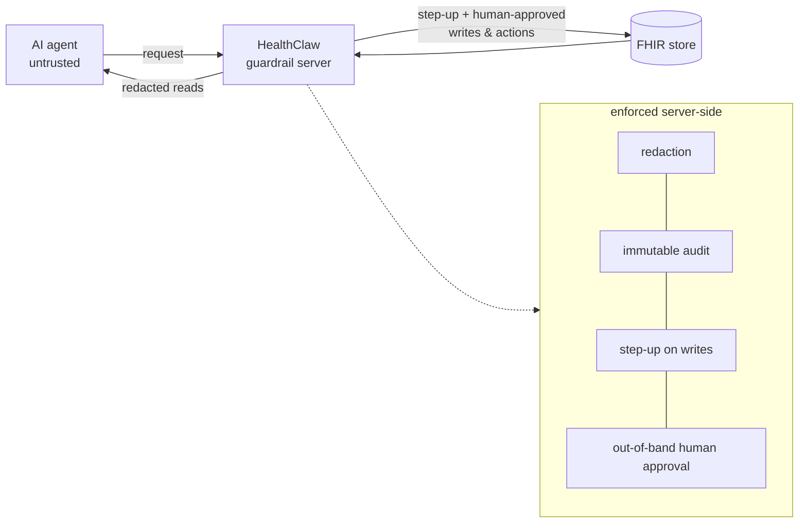
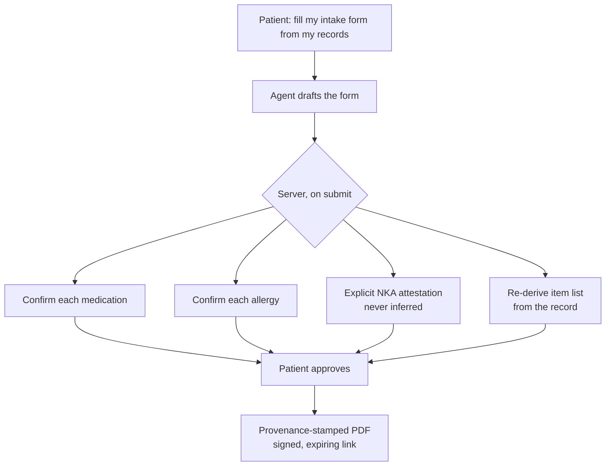

# Agents on FHIR Need an Enforcement Layer, and It Should Be Open Source

Agents on FHIR are no longer a demo category. Over the past year this community
has shown agents that read Implementation Guides and generate new ones, build
dashboards, drive Questionnaire builders, and operate FHIR servers through MCP.
The read-and-generate problem is largely solved.

The unsolved problem is what happens when an agent is allowed to act on its own:
write to the record, fill out a form a clinic will treat as ground truth,
request a refill, contact a pharmacy. A supervised agent, with a human checking
each step, is a smaller risk. The hard case is the unsupervised one, and every
action it takes needs controls the agent cannot talk its way around. Prompt-level
instructions do not qualify. An agent's system prompt is a request; only the
server can enforce.

This post describes how we built that enforcement layer as an open-source
project, **HealthClaw Guardrails**, and **CareAgents**, the consumer app that
runs on top of it. It then makes a broader argument: healthcare AI is converging
on open models and open source. The reason is not that open source is a cause to
believe in. It is that the structure of healthcare, from procurement to
regulation to patient rights, keeps producing requirements that only open
systems can meet.

## The Architecture: Guardrails Live Server-Side

HealthClaw Guardrails is an MIT-licensed layer that sits between AI agents and
FHIR data. The design rule is simple: no safety property depends on client
behavior. The server enforces four things.



*Figure 1. The guardrail layer sits between an untrusted agent and the FHIR
store. Reads come back redacted; writes and actions require server-enforced
controls the agent cannot mint or bypass.*

**Redaction on reads.** Identifiers are stripped using HIPAA Safe Harbor rules
before a resource reaches the agent. A patient-controlled variant also exists,
so redaction policy belongs to the person, not the integrator.

**Audit on everything.** Every resource access emits an AuditEvent. The server
writes and signs each one, so an agent cannot forge, alter, or suppress a
record. Audit detail is kept free of PHI, which means a human reviewer or
security team can inspect the full trail without being exposed to protected
data.

**Step-up on writes.** Any write requires a single-use, server-minted step-up
credential. An agent cannot mint one for itself.

**Out-of-band human approval on actions.** An agent can propose and submit a
real-world action, but execution happens only through a separate approval
endpoint. No code path lets an agent approve its own action.

The part that keeps us honest is that these claims are graded, not asserted. A
conformance harness grades those four controls plus three more that keep them
honest: tenant isolation, attestation for "no known allergies," and error
fidelity, where unknown parameters and unsupported search modifiers are surfaced
rather than silently dropped. Seven properties in all. It runs in CI as a merge
gate, and any live deployment can grade itself:

```bash
curl 'https://app.healthclaw.io/r6/fhir/$conformance?format=text'
```

If a deployment regresses, the grade says so. A graded architecture tells you
when it has broken; a safety claim in a whitepaper cannot.

## The Consumer Surface: An Agent That Can Finish a Real Task

CareAgents (careagents.cloud) is the consumer app on top of the guardrail layer.
Sign in with a passkey, connect records through a connector registry (verified
provider logins via Fasten, Apple Health via Open Wearables, or synthetic sample
data), and create an agent reachable on web, Telegram, or iMessage. Two
properties matter more than the feature list.

First, CareAgents stores no health data. Its only path to PHI is the guardrail
layer's HTTP API. The consumer app holds accounts and connection metadata,
nothing clinical.

Second, the agent can complete a real action, but not by itself. Take the
flagship flow: "I'm seeing a new doctor next week, fill out my intake form from
my records." The agent populates the intake form from the record, then reaches a
wall it cannot cross. On submit, the server enforces four things in sequence:

1. Each medication and each allergy requires individual confirmation by the
   patient.
2. "No known allergies" requires an explicit human attestation. It is never
   inferred from an empty list.
3. The server re-derives the item list from the record at submit time, so a
   crafted request cannot drop or skip a row.
4. Approval produces a provenance-stamped PDF, delivered over a signed, expiring
   link.



*Figure 2. The intake flow. The agent proposes; the server re-derives the list
on submit and routes every item to the patient for approval. No code path lets
the agent approve its own action.*

That is what "agentic" should mean in healthcare: the agent does the tedious
work, the human keeps the decisions, and the server makes that division of labor
non-optional.

## Ten Reasons Healthcare AI Is Moving Toward Open Models and Open Source

**A safety claim you cannot inspect is hard to trust.** Every vendor says its
agent is safe with PHI. Open source turns that assertion into something a
hospital security team can read, run, and attack. A closed system asks you to
trust it; an open one invites you to check. And opening the code does not open a
door: the controls are enforced on the server, not hidden in it, so knowing
exactly how redaction, step-up, and approval work does not give an attacker a
way around them.

**Health IT standards are won by open reference implementations.** FHIR spread
because HAPI, open test servers, Synthea, and public connectathons made it cheap
to adopt and hard to argue against. Agent-safety patterns for FHIR, including
redaction contracts, audit shapes, and human-approval rails, will standardize
the same way: someone ships a working open reference, and the ecosystem
converges on it.

**Regulators reward demonstrable controls, not described ones.** HIPAA
security-rule audits, FTC Health Breach Notification Rule exposure, and the EU AI
Act's high-risk requirements all reward controls you can demonstrate on demand.
An open codebase plus a machine-gradable conformance endpoint is evidence a
reviewer can run. A vendor whitepaper is a description of one.

**The threat model is too large for any one team.** Prompt injection through
clinical documents, tenant-isolation bugs, silent parameter drops that widen a
search: these failure modes are far more likely to be caught by many adversarial
eyes than by a single team working alone. Open code is not automatically safe
code, but a bug in the open has a chance of being found that a bug in a closed
vendor's tree does not. In our repo, issues and counterexamples are the most
valued contribution.

**The model layer is commoditizing; the scaffolding is the durable part.**
Claude, GPT, Gemini, and open-weight local models are increasingly swappable
behind one adapter. What persists across model generations is the guardrail and
orchestration layer. A layer meant to outlive every model vendor should not be
tied to the survival of any single company, so hospitals depending on it are not
exposed if one vendor fails or changes course.

**Privacy-sensitive inference is pulling toward open-weight models.** For some
workloads, the strongest privacy posture is a model running inside the
hospital's own network, where no request leaves the building. A hosted frontier
API cannot run there; only an open-weight model can. A guardrail layer that
treats the model as a pluggable, untrusted component works the same way whether
the model is a remote API or a local open-weight one, because the server trusts
neither.

**Health systems buy what they can self-host.** Procurement, security review,
and data-residency rules make "run it in our VPC, no PHI leaves" a hard
requirement for much of the market. Here, open source is not a go-to-market
choice. It is the way to satisfy a requirement the buyer has already written
down.

**Patient data rights favor transparent, portable tooling.** Information
blocking rules and the individual right of access give patients their records
and the freedom to choose the tools that act on them. Closed systems can honor
those rights, and many in hospitals do. But a patient who can read and move
their data is better served by tools that are themselves inspectable and
portable, rather than by a stack that quietly rebuilds the silo the last decade
of policy worked to dismantle.

**Open failure modes make everyone's systems safer.** We publish our bugs. Two
recent examples: an audit-write failure that rolled back the caller's entire
transaction while still returning success, and a sign-in field that truncated
8-digit codes to 6. In a closed product these become quiet patches. In an open
one they become the community's regression tests.

**The ecosystem now composes out of open pieces.** MCP for tool exposure, open
connector registries for records and wearables, SMART on FHIR for authorization,
open questionnaire tooling for structured capture. When each layer is open,
integration is a pull request. When one layer is closed, it becomes a
business-development negotiation, and healthcare has lost enough years to those.

## The Layer Above: Trust and Identity

Enforcement is necessary but not sufficient. A guardrail server can prove that
it redacted, audited, required a step-up credential, and waited for a human tap.
It still has to answer a harder question that any relying party asks before it
lets an agent touch its system: who authorized this agent, for what, and how
sure are we?

That is identity-layer work, and it sits above the enforcement layer described
here. A complete answer needs a way to verify that a given agent is authorized
for a specific job; the scope of that job; a verifiable authorization token for
the consumer who deployed the agent, identified or pseudonymous; the identity
and authenticator assurance levels behind it (IAL/AAL); auditability; and
non-repudiation for dispute resolution. Most of that means extending OAuth and
OIDC, protocols written for a browser user, not for a delegated agent acting on
someone's behalf, in ways the standards do not yet cover.

We are beginning that work with digital-identity partners, and it is the natural
complement to a graded enforcement layer. The identity layer establishes who may
act and to what assurance; the enforcement layer makes those limits real at the
resource; and the signed audit trail ties the two together into evidence you
could take to a dispute.

## An Invitation

HealthClaw Guardrails is MIT-licensed and small enough to read in an afternoon:
a Python FHIR facade with the guardrail engine, a TypeScript MCP server exposing
tiered read and write tools, roughly 1,600 tests across both, and the
conformance harness gating CI. The guardrail pattern is deliberately
server-agnostic. The same propose, out-of-band approve, and audit rail belongs
in front of any FHIR store, including Aidbox.

There are two concrete ways to take part.

**Break it.** If you are building agents on FHIR, the most useful thing you can
send us is a counterexample: a prompt, a request, or a payload that gets past a
control it should not. Every one becomes a regression test.

**Build the layer above with us.** If you work on agent identity, delegation, or
verifiable authorization, help define how a relying party decides an agent is
safe to let in. That is the seam where we most want collaborators.

That is how an enforcement layer earns trust: in the open, with other people
trying to break it.

Repo: [github.com/aks129/HealthClawGuardrails](https://github.com/aks129/HealthClawGuardrails)
· Live conformance: `app.healthclaw.io/r6/fhir/$conformance`
· Consumer app: [careagents.cloud](https://careagents.cloud)
